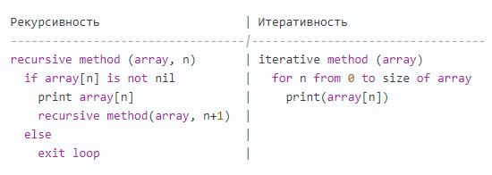

# Основные типы алгоритмов
1. [Рекурсивные_алгоритмы](#Рекурсивные_алгоритмы)
1. [Итеративные_алгоритмы](#Итеративные_алгоритмы)
1. [Сравнение_рекурсивности_и_итеративности](#Сравнение_рекурсивности_и_итеративности)
1. [Жадные_алгоритмы](#Жадные_алгоритмы)
1. [Полезные_ссылки_и_спасибо_за_предоставленные_материалы](#Полезные_ссылки_и_спасибо_за_предоставленные_материалы)

# Рекурсивные_алгоритмы
**Определение:**  
Этот алгоритм вызывает самого себя.  

- Рекурсивный сценарий — когда условный оператор используется для запуска рекурсии.  
- Базовый сценарий — когда условный оператор используется для прерывания рекурсии.

**Что вам нужно знать:**  
>Слишком глубокий уровень стека и переполнение стека.  

- Если при работе рекурсивного алгоритма вы столкнулись с чем-то из перечисленного, значит, вы всё испортили.  

- Это означает, что базовый сценарий не был ни разу запущен из-за ошибок, либо проблема была столь серьёзной, что у вас кончилась память, прежде чем рекурсия была прервана.  
- Знание того, сможете ли вы достичь базового сценария, является неотъемлемой частью правильного использования рекурсии.
- Такие алгоритмы часто используются при поиске в глубину.


# Итеративные_алгоритмы
**Определение:**  
Итеративным называется алгоритм, вызываемый неоднократно, но ограниченное количество раз. Каждый вызов является отдельной итерацией.  

Часто применяются для инкрементального прохождения по набору данных.

>**Инкремент** часто используется в языках программирования при организации цикла, где какая-то величина в каждом новом шаге цикла становится больше на единицу.  
**(Example JS: i++)**


**Что вам нужно знать:**
- Обычно итерации представлены в виде циклов, выражений **for, while...**.  
- Итерация — это однократный проход по набору данных.
- Такие алгоритмы часто применяются для обработки массивов.

# Сравнение_рекурсивности_и_итеративности
- Рекурсивность обычно более выразительна и проста в реализации.
- Итеративность потребляет меньше памяти.

**Псевдокод прохождения по массиву (вот почему для этого применяется итеративность)**



# Жадные_алгоритмы
**Определение:**
Жадными называют алгоритмы, выбирающие только ту информацию, которая удовлетворяет определённым критериям.

**Определение из книги “Парадигмы алгоритмического проектирования (жадные алгоритмы, разделяй и властвуй и динамическое программирование)”:** это такие алгоритмы, которые стремятся сделать оптимальный выбор в каждый момент времени. На каждом шагу выбирается лучший выбор, не задумываясь о будущем.

**Что вам нужно знать:**  
- Жадные алгоритмы используются для поиска оптимального решения данной проблемы.  
- Обычно они применяются к наборам данных, в которых лишь небольшая порция обработанной информации даёт желаемый результат.
- Часто жадные алгоритмы могут помочь в уменьшении «О» большого(Big O) другого алгоритма.

Жадные алгоритмы популярны, потому что они очень быстрые. Намного быстрее, чем две другие альтернативы (Разделяй и властвуй – Divide & Conquer, и Динамическое программирование Dynamic Programming).

>**Как мне создать жадный алгоритм?**  
Ваш алгоритм должен всегда отвечать на этот вопрос:   
**Каков лучший выбор в этот момент времени?**

**Псевдокод жадного алгоритма для поиска самой большой разницы между двумя числами в массиве**  
```
greedy algorithm (array)
  var largest difference = 0  
  var new difference = find next difference (array[n], array[n+1]) 
  largest difference = new difference if new difference is > largest difference
  repeat above two steps until all differences have been found
  return largest difference
 ```

# Полезные_ссылки_и_спасибо_за_предоставленные_материалы:
- [Шпаргалка для технического собеседования - Основные типы алгоритмов](https://habr.com/ru/company/mailru/blog/350326/)
- [Алгоритмы – часть 1. Жадные алгоритмы, алгоритм Дейкстры.](https://webdevblog.ru/zhadnye-algoritmy-chast-1-algoritm-dejkstry/)  
- [Data Structure Visualizations](https://www.cs.usfca.edu/~galles/visualization/Algorithms.html)
- [JS: Interview Algorithm](http://www.thatjsdude.com/interview/js1.html)
- [Algorithms and data structures](https://www.youtube.com/watch?v=cWwoU6fjYDQ&index=3&list=PLe--kalBDwjhdXudsOpKooP6q9bAl3rPG)
- [JavaScript Algorithms and Data Structures](https://github.com/trekhleb/javascript-algorithms)
- [Lecture: Basic Algorithms](https://github.com/rolling-scopes-school/lectures/blob/master/lectures/basic-algorithms.md)