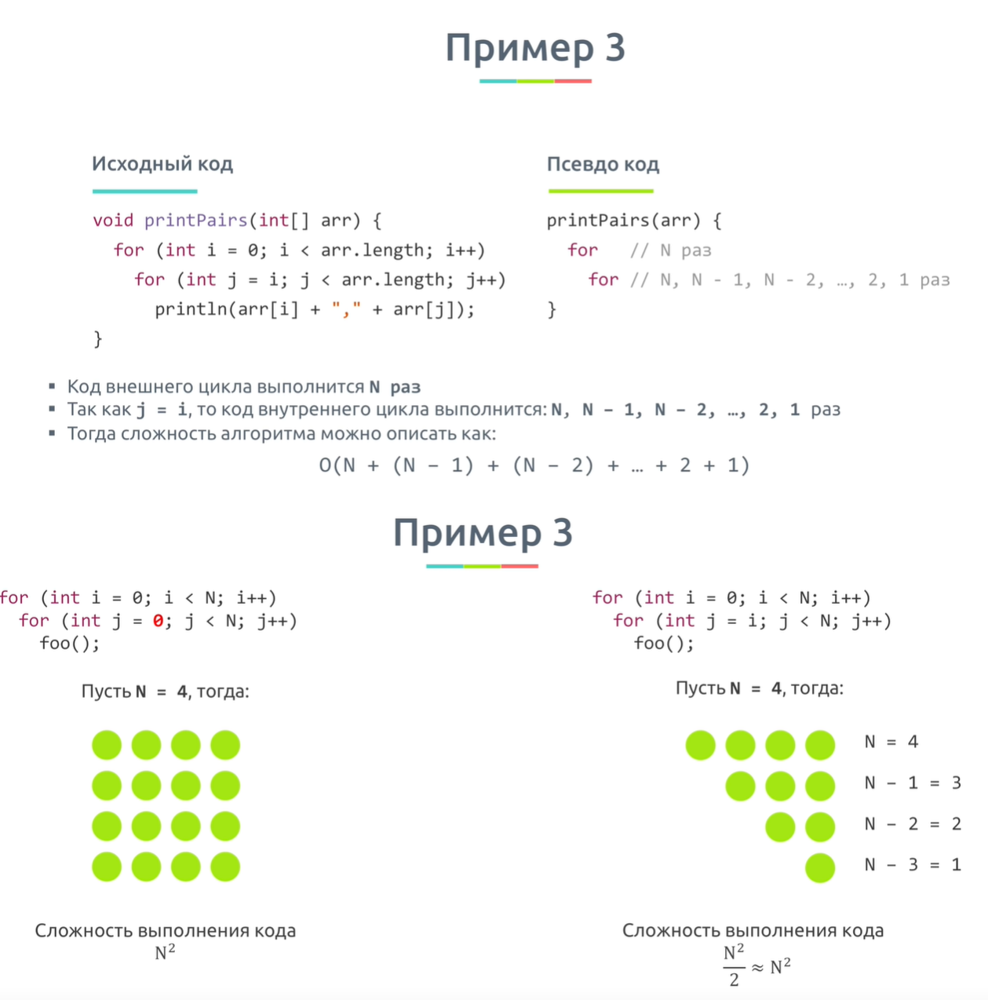

# Big-O
**В данном материале рассматриваются только базовые вещи о Big-O**

1. [Зачем_это_надо?](#Зачем_это_надо?)
1. [Верхняя_граница_или_отбрасывание_констант](#Верхняя_граница_или_отбрасывание_констант)
1. [Понятие_Неважная_сложность](#Понятие_Неважная_сложность)
1. [Складывать_или_умножать_Cложности_выполнения_алгоритма](#Складывать_или_умножать_Cложности_выполнения_алгоритма)
1. [Логарифмы?](#Логарифмы?)
1. [Примеры_определения_сложности](#Примеры_определения_сложности)
1. [Выводы](#Выводы)
1. [Полезные_ссылки_и_спасибо_за_предоставленные_материалы](#Полезные_ссылки_и_спасибо_за_предоставленные_материалы)

# Зачем_это_надо? 
для написания эффективного кода, каждому разработчику необходимо знать, как оценивать сложность алгоритмов.

**Big-O** - Оценка сложности/скорости выполнения  алгоритма.

>Любой алгоритм включает в себя какое то количество шагов.  
**Идея Big O** -> показать какое количество шагов(тактов) необходимо сделать чтобы алгоритм закончил свое выполнение.

## Пример #1:
**Big O** -> показывает зависимость между массивом на 1000 элементов, который подается на вход функций и количеством тактов процессора,
которое необходимо выполнить, что бы алгоритм обработал эту 1000 элементов.

## Пример с самолетом #2:

>**O** - принятое значение концепции Big-O. В скобках указывается формула описывающая поведение алгаритма.

>**O(N)** - чтается как "O от N":  зависимость прямопропорциональна или просто N.

### Первый случай:   
**Сложность является прямопропорциональной и зависит от количества передаваемых бит.**  

Т.е -> больше бит, дольше передавать. Зависимость является линейной.  
В рамках Big-O зависимость принято описывать используя букву "N".  
Если же у нас есть другие переменные, то это будут "M,L,K..." и другие буквы.

### Второй случай:  
Представляет собой постоянную величину.

**Почему О(1) а не О(0)? Ведь нет зависимость между размером файла и скоростью самолета.**  
На самом деле **1** - это символизация того, что что-то происходит.  

Если бы самолет не летел а файлы бы не передавались, значит сложность была бы **O(0)**.  
То же самое касается алгаритмов -> если мы не исполняем никакой код, значит ничего не происходит и значит сложность равна **O(0)**.  
Если же мы хотя бы вызвали функцию которя ничего не выполняет, **то мы уже совершили одно действие(вызов)**,  
**следовательно сложость равна О(1)**.  

## Примеры на функциях #3:

>Для того что бы решить эту задачу, не важно понимать что делает  функция, нужно понимать чему равна её сложность.  

### sum():  
Быстродействие этой функции прямопропорционально входному значению параметра N.  
Чем больше N, тем больше раз функия вызовет сама себя.  
**Следовательно сложность функции sum равна О(N).**

### pairSumSequence():
В цикле складывает какие то пары чисел, вызывая функцию pairSum.  
Цикл выполняется от 0 до n, другими словами чем больше n тем больше раз выполнится цикл.  
Например если n=3 -> цикл выполнится от 0 до 2х(для 0,1 и для 2ки) -> итого: 3 раза.  
Если n=10 -> цикл выполнится 10 раз и т.д.  
**Следовательно сложность функции pairSumSequence равна О(N).**

### pairSum():
pairSum  не имеет ни циклов ни рикурсий, она всегда выполняет константное количество операций.  
**Следовательно сложность функции pairSum равна О(1).**

# Верхняя_граница_или_отбрасывание_констант 
(одно и то же)  
При оценке сложности алгоритма мы не говорим о каких то конечных входных значениях.

## Допустим за сколько выполнится алгоритм, если входной массив имеет 3 элемента?  
Такая оценка не имеет смысла, поскольку ответ будет **"мгновенно"**.  
**3 -> это слишком мало чтобы оценить алгоритм.**

## Тогда какое число это много? 
На самом деле мы говорим о том **как алгоритм будет вести себя на бесконечности**.  
Если алгоритм для n элементов, выполняет n тактов + 1 такт для (допустим)вывода результата на экран, то сложность такого алгоритма все равно N, так как бесконечность гараздо больше единицы.

То же самое касается алгаритмов, которые выполняются за 2N || 3N || 5N.  
**2/3/5  бесконечностей это по сути одно и тоже, это все равно бесконечность.**

_**Таким образом:**_

# Понятие_Неважная_сложность

# Складывать_или_умножать_Cложности_выполнения_алгоритма

# Логарифмы?

# Примеры_определения_сложности

>**Пример 7:** По этому при сортировке массива мы должны учитывать саму сложность алгоритма но и сложность сравнения строк. И отсюда появляется буква "L".
Это доказывает что не зная Big-O вы можете просесть в L раз по производительности в вашем коде.

# Выводы
- Big O показывает **темп роста функции**. Следовательно, **мы не увеличиваем константы и "неважную" сложность**
- Последовательность действий - сложение.  
Вложенные действия - умножение.
- Для алгоритма, где **на каждой итерации берется половина элементов** - сложность будет включать **O(log N)**

# Полезные_ссылки_и_спасибо_за_предоставленные_материалы:
- [Cronis Academy - Оценка сложности алгоритма. Сложность алгоритмов. Big O, Большое О](https://www.youtube.com/watch?v=ZRdOb4yR0kk&t=1165s)
-[Big-O cheat sheet](https://www.bigocheatsheet.com/)

