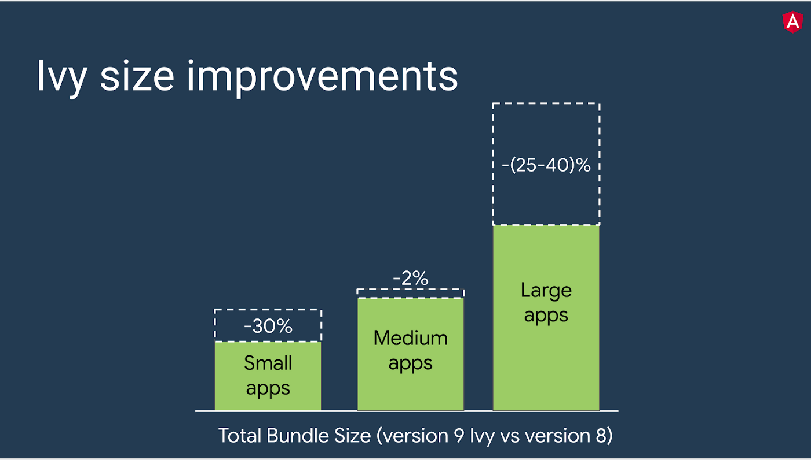

# Angular_9_Что_нового?
**В данном материале рассматриваются только некоторые основные вещи**

1. [Ivy](#Angular_9_Что_нового?)
1. [AOT](#AOT)
1. [@ViewChild](#@ViewChild)
1. [Полезные_ссылки_и_спасибо_за_предоставленные_материалы](#Полезные_ссылки_и_спасибо_за_предоставленные_материалы)

# Ivy
**Ivy** - Движок который интерпритируе более эффективно код который вы пишите на angular.  

В основном он связан с тришейкингом(движок автоматически избавляется от тех элементов фреймворка которые вы не используете).   
Приложение становиться намного быстрее и меньше по размеру.  
Другими словами - крутая оптимизация, за счет которой вам даже не придется что то делать.

9 версия Angular  полностью перешла на Ivy компилятор:
- **Smaller bundle sizes**   
Это про tree-shaking. Идея в том что если есть какие то не используемые функции, которые лежат в ядре,
то при компиляции они убираются. Таким путем достигается меньшее количество кода.  
Т.е это плюс к производительности без каких либо действий со стороны разработчика.*
- **Faster testing**  
Тестирование стало на 40-50% быстрее
- **Better debugging**
- **Improved CSS class and style binding**
- **Improved type checking**  
Включение строгой проверки внутри шаблонов.  
Теперь поддерживаются 2 дополнительных флага, 
таких как ``fullTemplateTypeCheck``(Активация этого флага говорит компилятору проверять все в вашем
 шаблоне - ngIf, ngFor, ng-template, и т.д)) и ``strictTemplates``
(При активации этого флага будут применяться самые строгие правила системы типов для проверки типов):

- **Improved build errors**  
Было:

Стало:

- **Improved build times, enabling [AOT](#AOT) on by default**  
- **Improved Internationalization**

# AOT
AOT включен по умолчанию в angular 9 - [AOT - angular.io description](https://angular.io/guide/aot-compiler)
  
Когда мы пишем код на angular, мы в основном взаимодействуем с typeScript и с шаблоном,
но шаблон это не валидный html потому что там присутсвует специальный синтаксис который касается самого 
angular(дерективы типа *ngIf/ng-for и т.д.).  
И для того что бы браузер понимал о чем речь, эти шаблоны нуждаются в предварительной компиляции
и преобразования этого в эффективный JS код.  

**Есть два типа компиляции:** 
1. Just-in-Time (который в рантайме в браузере сразу все делал)
1. Ahead-of-Time (который делает все заранее и тем самым мы получаем меньше кода, 
больше производительности + заранее можем получать некоторые ошибки если они присутствуют).  
По умолчанию в angular раньше использовался **Just-in-Time**  

AOT - чуть более строгий чем Just-in-Time -> например приватные пременные нельзя 
использовать в шаблоне.

# @ViewChild
В **angular8** было обязательство -> когда мы использовали дериктивы ``@ViewChild``
и получали ссылку на какуюто референцию в шаблоне(в примере ``"myInput``),
нас обязывали указывать обязательный параметр ``{static:false или true}``

# Полезные_ссылки_и_спасибо_за_предоставленные_материалы:
- [Version 9 of Angular Now Available - Project Ivy has arrived! (blog.angular.io)](https://blog.angular.io/version-9-of-angular-now-available-project-ivy-has-arrived-23c97b63cfa3)
- [Как правильно перевести приложение на angular9](https://update.angular.io/)
- [AOT - angular.io description](https://angular.io/guide/aot-compiler)