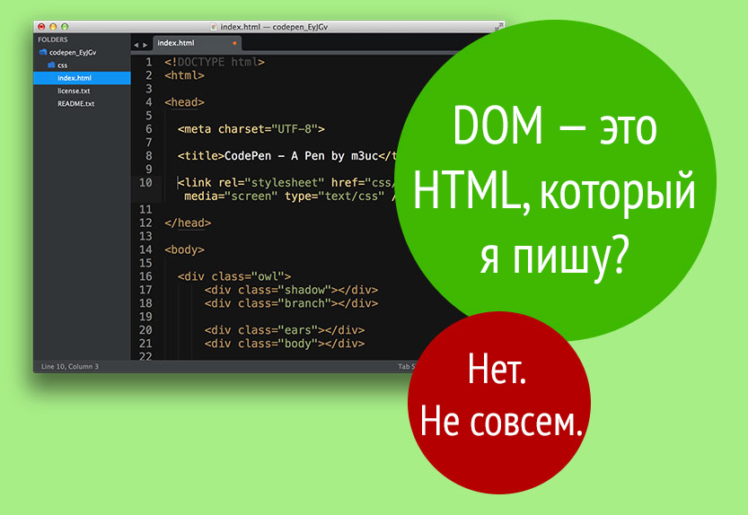
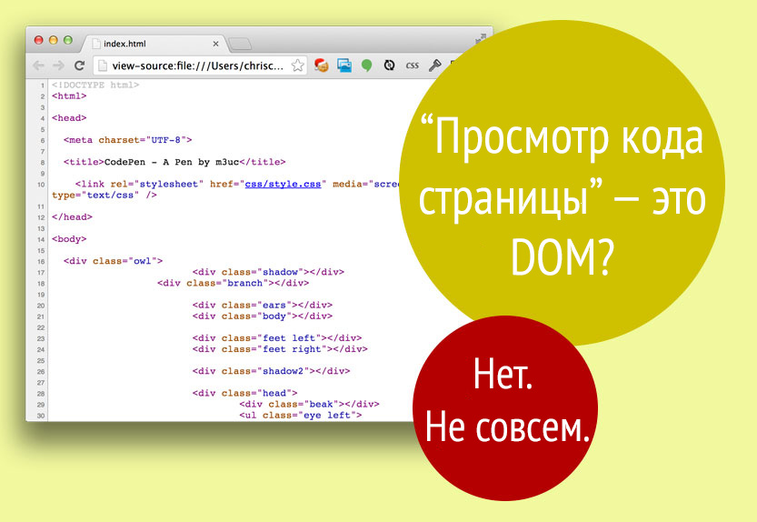
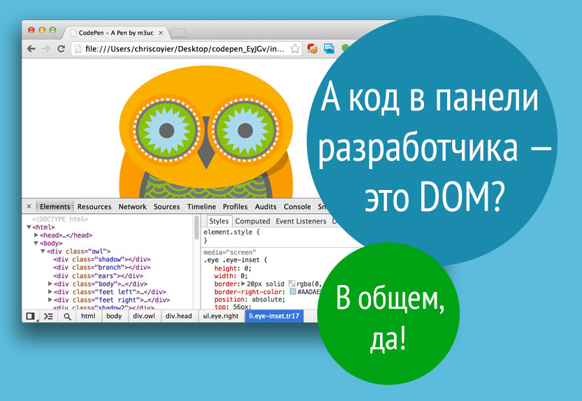

# DOM
1. [Что_такое_DOM?](#Что_такое_DOM?)
1. [Когда_визуальное_представление_DOM_отличается_от_HTML_кода?](#Когда_визуальное_представление_DOM_отличается_от_HTML_кода?)
1. [DOM_API](#DOM_API)
1. [Window_object](#Window_object)
1. [Полезные_ссылки_и_спасибо_за_предоставленные_материалы](#Полезные_ссылки_и_спасибо_за_предоставленные_материалы)

# Что_такое_DOM?

DOM -> (Document Object Model) это объектная модель документа, которую браузер создаёт в памяти компьютера на основании HTML-кода, полученного им от сервера.

Браузер, когда запрашивает страницу и получает в ответе от сервера её исходный HTML-код, должен сначала его разобрать. В процессе анализа и разбора HTML-кода браузер строит на основе него **DOM-дерево**.  

После выполнения этого действия и ряда других браузер приступает к отрисовке страницы. В этом процессе он, конечно, уже использует созданное им DOM-дерево, а не исходный HTML-код.

  
Функция «просмотра кода страницы» всего лишь показывает HTML-код, формирующий страницу. Это практически тот самый HTML-код, который вы написали в редакторе.

Если вы откроете панель инструментов разработчика и увидите там что-то вроде HTML, то вы обнаружите, что на самом деле это — визуальное представление DOM.

# Когда_визуальное_представление_DOM_отличается_от_HTML_кода?
Например, если в вашем HTML-коде есть ошибки, и браузер исправил их за вас. Допустим, у вас есть элемент ``<table>``, и вы пропустили обязательный элемент ``<tbody>``. Браузер просто добавит этот элемент ``<tbody>`` за вас. Он будет присутствовать в DOM, поэтому вы сможете найти его с помощью JavaScript, или стилизовать с помощью CSS, даже если его нет в написанном вами HTML-коде.  
И тем не менее, наиболее вероятная причина в различиях между написанным кодом и фактическим DOM в том, что **JavaScript может динамически изменять DOM**

# DOM_API
это набор огромного количества различных объектов, их свойств и методов, которые мы можем использовать для чтения и изменения DOM.

Для работы с DOM в большинстве случаев используется JavaScript, т.к. на сегодняшний день это единственный язык программирования, скрипты на котором могут выполняться в браузере.

## Зачем нам нужен DOM API? 
Он нам нужен для того, чтобы мы могли с помощью JavaScript изменять страницу на «лету», т.е. делать её динамической и интерактивной.

# Window_object
Объект ``window`` представляет окно, содержащее документ DOM.  

``window.document`` указывает на объект ``document`, загруженный в окно.   

Свойства и методы этого объекта могут быть вызваны без явной ссылки на ``window``, поскольку оно представляет глобальный объект. Итак, предыдущее свойство ``window.document`` обычно называется просто ``document``.  

## Properties  
Cписок полезных свойств, на которые вы, скорее всего, будете ссылаться:
- ``console.log``, ``console.error``
- ``document`` как уже было сказано, указывает на объект ``document``, ключ к взаимодействию DOM, которое вы будете выполнять 
- ``history`` ает доступ к ``History API``
- ``location`` предоставляет доступ к Location interface, из которого вы можете определить URL, протокол, хеш и другую полезную информацию
- ``localStorage`` это ссылка на Web Storage API localStorage object
- ``sessionStorage`` это ссылка на Web Storage API sessionStorage object

## Methods
``alert(), setInterval(), clearInterval(), setTimeout()`` и т.п.

# Полезные_ссылки_и_спасибо_за_предоставленные_материалы:
- [Что такое DOM?](https://frontender.info/dom/)
- [The Document Object Model (DOM)](https://flaviocopes.com/dom/)
- [**Путь критического рендеринга**](learnFrontend/blob/master/lectures/html_css/rendering/rendering.md)
- [Что такое DOM и зачем он нужен?](https://itchief.ru/javascript/dom)
- [Игорь Алексеенко — Почему мой сайт тормозит и как это исправить HolyJs](https://www.youtube.com/watch?v=z9YG9XBwCKo)
- [Классические приёмы программирования во фронтенде — Игорь Алексеенко](https://www.youtube.com/watch?v=mc7EMdyawBk)