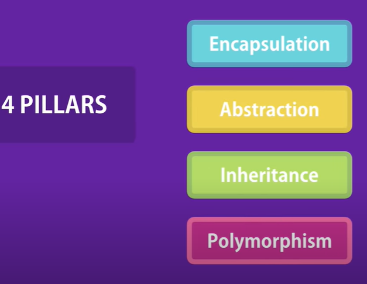

# OOP

1. [Useful_links_and_thanks_for_materials](#Useful_links_and_thanks_for_materials)

# Abstraction
Abstraction is the process of showing only essential/necessary features of an entity/object 
to the outside world and hide the other irrelevant information.
For example to open your TV we only have a power button,
It is not required to understand how infra-red waves are getting generated in TV remote control.

# Encapsulation
Encapsulation means wrapping up data and member function (Method) together into
a single unit i.e. class. Encapsulation automatically achieve the concept of data hiding providing 
security to data by making the variable as private and expose the property 
to access the private data which would be public.

# Inheritance 
The ability of creating a new class from an existing class.
Inheritance is when an object acquires the property of another object.
Inheritance allows a class (subclass) to acquire the properties and behavior
of another class (super-class). It helps to reuse, customize and enhance the existing code.
So it helps to write a code accurately and reduce the development time.

# Polymorphism
Polymorphism is derived from 2 Greek words: poly and morphs.
The word "poly" means many and "morphs" means forms. 
So polymorphism means "many forms".
A subclass can define its own unique behavior and still share the same functionalities 
or behavior of its parent/base class. A subclass can have their own behavior 
and share some of its behavior from its parent class not the other way around. 
A parent class cannot have the behavior of its subclass.

> one interface / many forms

# Useful_links_and_thanks_for_materials
- [The four pillars for OOP are Abstraction, Encapsulation, Inheritance, Polymorphism.](https://www.linkedin.com/pulse/4-pillars-object-oriented-programming-pushkar-kumar/)