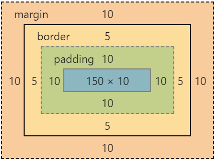
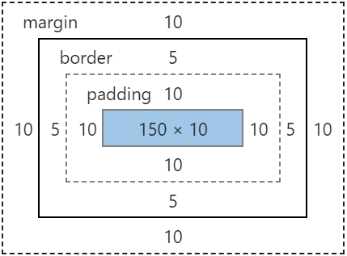
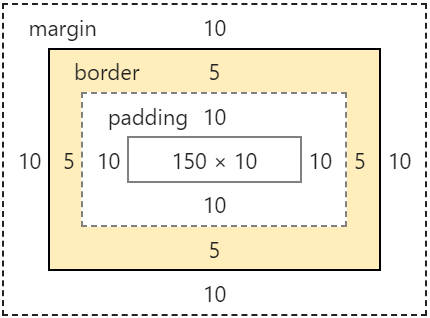
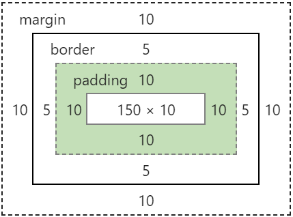
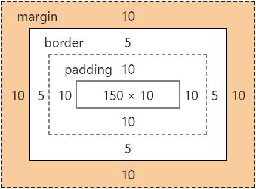

# Box Model или Блоковая модель / Боксовая модель. 
Элементы  (X)HTML-документа с точки зрения CSS представляются в виде прямоугольных блоков,

   

Для всех элементов - margin, padding и border по умолчанию нулевое значение.  
Исключением является тег `<body>`, для которого свойство `margin` имеет ненулевое значение, причем в разных браузерах свои значения. 
Поэтому в проекте в файле *reset.css* (или *normalize* - файл для сброса дефолтных стилей браузера) для тега `body` мы пишем `body {margin: 0;}`.

Периметр каждой из областей называется краевой линией, которая имее 4 сегмента:  
- top
- right
- bottom
- left 

### Content
Размеры области content определяются свойствами `width` и `height`

   
 
По умолчанию эти свойства имеют значение `auto`, при котором размеры элемента определяются автоматически.  
Например тег `div` вместе со всеми отступами и бордерами, по умолчанию занимает всю ширину клиентской области браузера, а по высоте - столько сколько необходимо для отображения контента + бордеры и отступы.  

**Так же можно задать следующие значения:**
- `max-width, max-height` - определить максимальные размеры элемента. Значение по умолзанию **0**.
- `min-width, min-height` - определить минимальные размеры элемента. Значение по умолзанию **0**.  

### border
 

**Варианты записи:**
```
border: 5px solid black; - применяется ко всем сторонам
border-top: 5px;
border-bottom: 5px;
border-right: 5px;
border-left: 5px;
```
### padding
  

**Варианты записи:**
```
padding: 10px; - применяется ко всем сторонам
padding: 10px 10px; - vertical | horizontal
padding: 10px 10px 10px; - top | horizontal | bottom
padding: 10px 10px 10px 10px; - top | right | bottom | left
```
### margin
  

**Варианты записи:**
```
margin: 10px; - применяется ко всем сторонам
margin: 10px 10px; - vertical | horizontal
margin: 10px 10px 10px; - top | horizontal | bottom
margin: 10px 10px 10px 10px; - top | right | bottom | left
```

## box-sizing
Определяет, как пользовательский агент должен рассчитывать общую ширину и высоту элемента.  

`box-sizing` используется для изменения блочной модели CSS применяемой по умолчанию - `box-sizing: content-box;`  
- **content-box** - Свойства **width** и **height** вычисляются исключительно по контенту, и не включая **margin**, **padding** и **border**.  
*Например:* если `{width: 350px}` и `{border: 10px solid black}` тогда ширина блока будет равной **370px**. 
- **border-box** - Свойства **width** и **height** вычисляются по контенту, **padding** и **border** (padding и border будут внутри блока), но не включая **margin**.  
*Например:* если `{width: 350px}` и `{border: 10px solid black}` тогда ширина блока будет, все также, равной **350px**, а ширина контента будет равной **330px**.  


