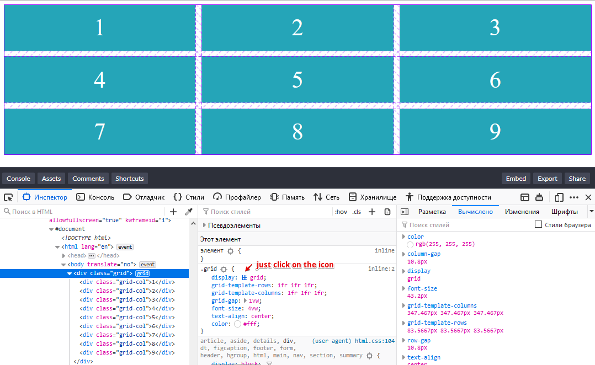
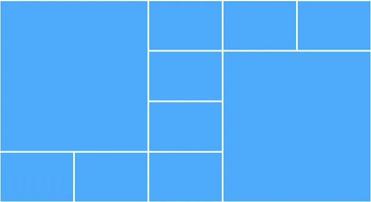
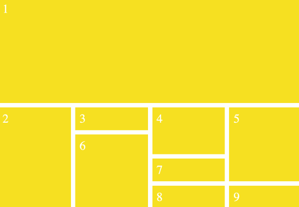

# Grid Layout
**Grid** это набор пересекающихся горизонтальных и вертикальных линий, которые создают размеры и позиционируют систему координат для контента в grid-контейнере.  

## Создаём Grid 3x3 (используем Less)
[codepen](https://codepen.io/MariskaS/pen/GRKvbwY)
```
<div class="grid">
  <div class="grid-col">1</div>
  <div class="grid-col">2</div>
  <div class="grid-col">3</div>
  <div class="grid-col">4</div>
  <div class="grid-col">5</div>
  <div class="grid-col">6</div>
  <div class="grid-col">7</div>
  <div class="grid-col">8</div>
  <div class="grid-col">9</div>
</div>

// Variables.
@color-white: #fff;
@color-blue: #25A5B8;
@fon-size-grid: 4vw;

// Grid styles.
.grid {
  display: grid; // Превращает элемент в grid контейнер
  grid-template-rows: 1fr 1fr 1fr; // Выстраивает ряды в гриде
  // Вместо grid-template-rows: 1fr 1fr 1fr можно написать grid-template-rows: repeat(5, 1fr);
  grid-template-columns: 1fr 1fr 1fr; // Выстраивает колонки в гридах.
  grid-gap: 1vw; // Выставляет отступы между колонок.
  font-size: @fon-size-grid;
  text-align: center;
  color: @color-white;
  
  &-col {
    padding: .4em;
    background: @color-blue;
  }
}
``` 
**display: grid** превращает элемент в grid контейнер и автоматически делает всех прямых потомков этого элемента — **grid элементами**.  
Так-же можно использовать **display: inline-grid**, что создать строчный грид-контейнер. Или же вы можете использовать **display: subgrid** *(используется на grid элементах)*, чтобы создать подсетку.  
Большинство грид свойств не наследуются, что означает то, что ваш вложенный грид не будет наследовать значения своего родительского грида. Это позволяет вам вносить изменения в родительский грид, без непреднамеренного влияния на вложенный грид.

## Инспектор Грид 
Интспектор гридов в DevTools визуализирует линии гридов и отступы между ними, что очень полезно если у вас сложный грид.  
Для Firefox есть встроенная тулза, пример использование ниже:  
 

Для Google Chrome есть различные плагины типа [Css Grid Highlighter for Chrome](https://github.com/ademilter/chrome-css-grid-highlighter)

## Домашнее задание (делать в указанном порядке)
1. ознакомиться с [Sass/Scss](https://sass-lang.com/documentation/variables)
1. ознакомиться с [Less](http://lesscss.org/#variables)
1. переписать [код](https://codepen.io/MariskaS/pen/GRKvbwY) на Sass и на Scss
1. почитать - [Вёрстка на Grid в CSS. Полное руководство и справочник](https://medium.com/@stasonmars/%D0%B2%D0%B5%CC%88%D1%80%D1%81%D1%82%D0%BA%D0%B0-%D0%BD%D0%B0-grid-%D0%B2-css-%D0%BF%D0%BE%D0%BB%D0%BD%D0%BE%D0%B5-%D1%80%D1%83%D0%BA%D0%BE%D0%B2%D0%BE%D0%B4%D1%81%D1%82%D0%B2%D0%BE-%D0%B8-%D1%81%D0%BF%D1%80%D0%B0%D0%B2%D0%BE%D1%87%D0%BD%D0%B8%D0%BA-220508316f8b) *(P.S. если что то не понятно, смело используйте Google и ищите другой источник информации)*
1. написать код для 2х гридов как на картинках:  
    - используйте **Less**:  
    

    - используйте **Scss**:  
     

## Полезные ссылки
- [How To: Use CSS Grid Layout to Make a Simple, Fluid Card Grid](https://bryanlrobinson.com/blog/howto-css-grid-layout-to-make-a-simple-fluid-card-grid/) 
- [Вёрстка на Grid в CSS. Полное руководство и справочник](https://medium.com/@stasonmars/%D0%B2%D0%B5%CC%88%D1%80%D1%81%D1%82%D0%BA%D0%B0-%D0%BD%D0%B0-grid-%D0%B2-css-%D0%BF%D0%BE%D0%BB%D0%BD%D0%BE%D0%B5-%D1%80%D1%83%D0%BA%D0%BE%D0%B2%D0%BE%D0%B4%D1%81%D1%82%D0%B2%D0%BE-%D0%B8-%D1%81%D0%BF%D1%80%D0%B0%D0%B2%D0%BE%D1%87%D0%BD%D0%B8%D0%BA-220508316f8b) 
- [Правильная верстка CSS Grid - webformyself](https://webformyself.com/pravilnaya-verstka-css-grid/) 
- [Основные понятия Grid Layout
](https://developer.mozilla.org/ru/docs/Web/CSS/CSS_Grid_Layout/Basic_Concepts_of_Grid_Layout)
- [css-tricks.com/snippets/css/complete-guide-grid](https://css-tricks.com/snippets/css/complete-guide-grid/) - Этот сайт стоит запомнить, т.к он содержит много полезной информации.
- [Lea Verou - если вы когда либо использовали \<dl>...\</dl>](https://twitter.com/leaverou/status/931029151762481152)  посмотрите [как можно упростить себе жизнь используя Grid](http://dabblet.com/gist/12b1d1e078510900c7ab206da1a0ff2e) 
(P.S. запомните имя Lea Verou, у нее можно многому научиться).
