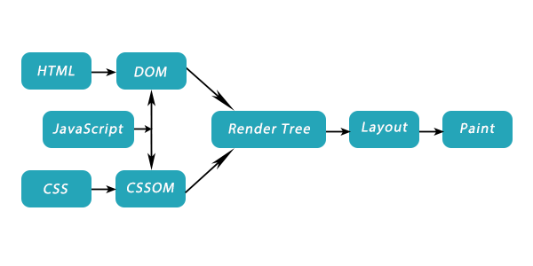
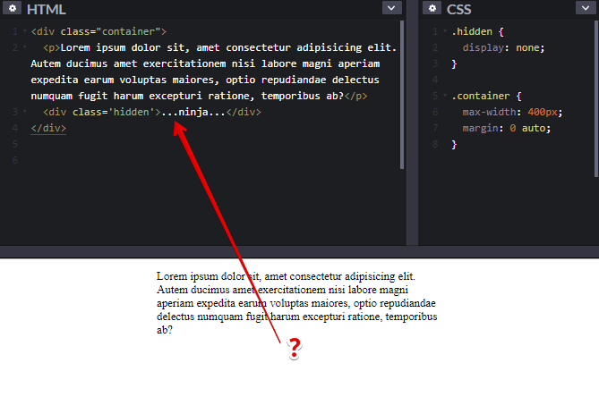

# Путь критического рендеринга
После того как браузер получает HTML ответ от сервера, проходит еще множество этапов перед отрисовкой пикселей на экране. Последовательность действий, которую должен пройти браузер для первичной отрисовки страницы называется **«путь критического рендеринга»** или **CRP (Critical Rendering Path)**.

Знание **CRP** полезно для понимания того, как можно улучшить производительность сайта путем уменьшения времени блокировки рендеринга.  

Решающее значение, особенно для пользователей мобильных устройств, имеет скорость появления визуального отображения страницы на экране. Важен именно критический путь — так как далеко не весь код на странице производит что-либо в окне браузера. 

**CRP проходит 6 этапов:**
1. построение дерева [DOM](#DOM)
1. построение дерева [CSSOM](#CSSOM)
1. [запуск JavaScript](#Запуск_JavaScript)
1. [создание дерева рендеринга или render tree](#Создание_дерева_рендеринга)
1. [генерация Layout](#Генерация_Layout)
1. [Painting (отрисовка)](#Painting)  

 

# Три шага для оптимизации критического пути рендеринг
1. **Минимизируйте объем трафика, передающегося на сайт** - Минифицируйте, сжимайте и кэшируйте ресурсы вашего сайта, а также его разметку.
1. **Минимизируйте блокирование рендеринга загрузкой CSS** - CSS блокирует не только рендеринг, но и выполнение скриптов.
1. **Минимизируйте блокирующий рендеринг JavaScript** - Если скрипты не взаимодействуют с DOM или CSSOM, вы можете загрузить их асинхронно.

## DOM
**DOM** - (Document Object Mode) объектная модель документа.  
DOM это не HTML-код, который вы пишите. HTML-код, который вы пишете, анализируется и преобразуется браузером впоследствии в DOM.  
**Когда визуальное представление DOM отличается от HTML-кода?**  
Например, если в вашем HTML-коде есть ошибки, и браузер исправил их за вас. Так же не будем забывать что JavaScript может динамически изменять DOM. 

## CSSOM
**CSSOM** - (CSS Object Model) объектное представление стилей DOM.  
Пока CSS не загружен - рендеринг блокирован.

## Запуск_JavaScript
JavaScript может добавлять узлы в DOM, парсер останавливает свою работу, пока скрипты не будут выполнены. JavaScript блокирует парсер.

## Создание_дерева_рендеринга
- Дерево рендеринга состоит из DOM и CSSOM.  
Браузер объединяет DOM и CSSOM, формируя модель визуализации.
- Модель визуализации содержит только те объекты, которые нужны для вывода страницы на экран.  
 Другими словами - в это дерево попадает только видимый контент. Оно не будет включать элементы, скрытые через CSS с помощью свойства *display: none*. 
  
- Далее формируется макет, отражающий расположение и размер каждого объекта (т.е. для каждого элемента render tree рассчитывается положение на странице).  
Браузеры используют поточный метод (flow), при котором в большинстве случаев достаточно одного прохода для размещения всех элементов (для таблиц проходов требуется больше).
- Объекты выводятся на экран.

## Генерация_Layout
Размер вьюпорта задается с помощью мета тега **viewport** в хедере документа. Если тег отсутствует, ширина вьюпорта по умолчанию составляет **980px**.  
Самое популярное значение вьюпорта – это чтобы его размер соответствовал ширине устройства:  
~~~
<meta name="viewport" content="width=device-width,initial-scale=1">  
~~~  

## Painting
На финальном этапе отрисовки видимый контент страницы конвертируется в пиксели на экране.  
Время отрисовки зависит от размера DOM и применяемых стилей. Некоторые стили занимают больше времени, чем другие. Например, сложный градиент background-image требует на отрисовку больше времени, чем обычный сплошной фон.  

## Полезные ссылки
- [What is the DOM?](https://css-tricks.com/dom/) 
- [Рендеринг WEB-страницы](https://habr.com/ru/post/224187/) 
- [Как ускорить рендеринг table (P.S. юзайте table-layout:fixed )](https://www.w3.org/TR/CSS2/tables.html#propdef-table-layout) 
- [Процесс визуализации - онлайн книга Ilya Grigorik](https://developers.google.com/web/fundamentals/performance/critical-rendering-path/?hl=ru) 
- [Chrome DevTools - Performance Documentation](https://developers.google.com/web/tools/chrome-devtools/evaluate-performance/) - В Google Chrome на вкладке *Performance* можно посмотреть как рендерится страничка.  
- [DOM](lectures/foundation/dom/dom.md)

