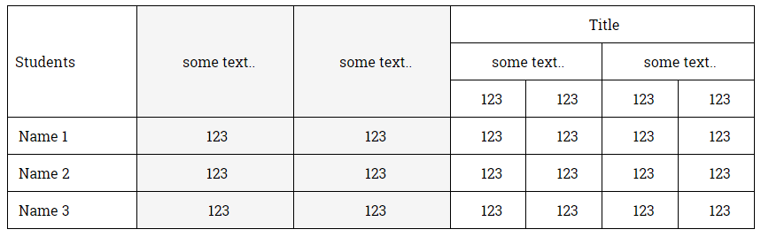

## Несколько важный вещей которые следует знать о таблицах 
Таблица состоит из строк и столбцов ячеек, которые могут содержать любой контент. Таблицы используются для упорядочения и представления данных.  
Раньше с помощью таблиц верстали макеты страниц, потому что это был единственный надежный способ создания макетов, учитывая возможности браузеров тех времен. Но теперь конечно же так никто не делает, поскольку макеты на таблицах - это много кода, нет гибкости и мозгоразрывающая поддержка кода. Да и написанные алгоритмы построения таблиц изначально предназначались только для представления данных.

В данном уроке не будет рассказываться о возможных свойствах тега `<table>`, т.к все они довольно просты и в интернете огромное количество примеров. 
Здесь фокусируется внимание только на моментах которые точно стоит знать.

### table-layout
Свойство ``table-layout`` - Алгоритм, используемый для размещения ячеек таблицы, строк и столбцов.  
Это свойство предназначено для управления режимом формирования ширины столбцов в таблице.   
**Возможные значения:**   
`table-layout: "auto | fixed | initial | inherit";`  

**Рассмотрим самые интересные:**
- **auto** - Значение по умолчанию. Автоматически определяет размеры элементов таблицы на основании содержимого. Например ширина таблицы определяется шириной ее столбцов, но браузеры могут использовать свои "фирменные" алгоритмы, которые обычно сначала загружают всю таблицу с данными, анализируют ее и только затем отображают.
  
- **fixed** - В случае применения этого режима, расчет ширины столбцов идет по первой строчке и все последующие используют это значение.  
Данный алгоритм начинает вывод таблицы без предварительного анализа ее содержимого(в отличае от *auto*)
  
 Выходит **fixed** - [быстрый алгоритм](https://www.w3.org/TR/CSS2/tables.html#propdef-table-layout), наиболее предпочтительный для быстрого рендеренга в браузере (особеннно актуально для таблиц с большим количеством строк и колонок).
 
**Возникает вопрос:**  
Почему для тега `<table>` - в свойстве `table-layout` по умолчанию в значении **auto** - зашит *"automatic table layout algorithm"* а не тот что используется в значении **fixed** - *fast algorithm* который луче для рендеринга страницы ?  
Сложно ответить на этот вопрос точно, но скорее всего *fast algorithm* появился после *"automatic table layout algorithm"* и как всегда с мировыми стандартами, для сохранения обратной совместимости дефолтные значения отменять не стали, чтобы не поломать существующие сайты.  

### HTML-таблицы и CSS-таблицы
Существуют такие понятия как:
- **HTML-таблицы** - когда для создания таблицы используется HTML-тег `<table>`
- **CSS-таблицы** - имитация того же поведения, но с помощью CSS-свойств
```
table    { display: table }
tr       { display: table-row }
thead    { display: table-header-group }
tbody    { display: table-row-group }
tfoot    { display: table-footer-group }
col      { display: table-column }
colgroup { display: table-column-group }
td, th   { display: table-cell }
caption  { display: table-caption }
```

Вы можете использовать то что для вас удобнее а еще лучше обсудить и договориться с командой заранее. Главное запомнить что нативные таблицы (тег `<table>`) должны использоваться только для верстки **таблиц** или **Email**. 
Хотя конечно у CSS-таблиц есть главное преимущество - они могут перестать быть таблицами, стоит только изменить их CSS-свойства. 

## Домашнее задание (делать в указанном порядке)
- самостоятельно ознакомиться [W3Schools - Tables Tutorial](https://www.youtube.com/watch?v=R73fiRbm2mM) (при необходимости используйте любые другие источники информации)
- сверстайте нативную табличку (`<table>`) как на картинке:  


## Полезные ссылки
- [HTML-таблицы - html5book](https://html5book.ru/html-table/)
- [table-layout - css-tricks](https://css-tricks.com/almanac/properties/t/table-layout/)
- [W3Schools - Tables Tutorial (youtube)](https://www.w3schools.com/css/css_table.asp)
- [W3Schools - Tables Tutorial](https://www.youtube.com/watch?v=R73fiRbm2mM)
