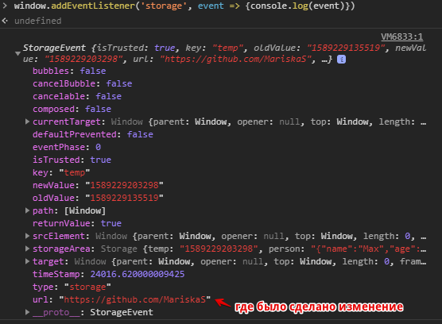

# Interview 
1. [Полезные_ссылки_и_спасибо_за_предоставленные_материалы](#Полезные_ссылки_и_спасибо_за_предоставленные_материалы)

## HTML
<details>
<summary>1. Box Model</summary>
<div>

Every element in CSS is a box.
Box-Model areas: border, margin, padding, content.

If we are talking about Box Model we need to remember about `box-sizing`.  
> default value `content box`

the most popular value is `border-box`.  
  
**For example:**   
I have a box with the property `width: 100px` 
if I set `padding: 20px` and `border: 2px` 
By default extra pixels add to the total size of my box so now `width` equivalent 122px.

But, if I use `box-sizing: border-box,` padding and border will be included
in my box and that means that I will get just 100px size.

</div>
</details>

<details>
<summary>2. Accessibility</summary>
<div>  

### aria-label
The `aria-label` attribute is used to define/определить a string that labels/помечает the current element. 
Use it in cases where a text label is not visible on the screen.  

Example of `aria-label` attribute:  
```html
<button aria-label="Close" onclick="myDialog.close()">X</button>
``` 
Since there is nothing indicating that the purpose of the 
button is to close the dialog, the ``aria-label`` attribute
is used to provide the label to any assistive/`[əsˈɪstɪv]`вспомогательных technologies.


### aria-labelledby
The `aria-labelledby` attribute establishes`[ɪstˈæblɪʃɪz]устанавливает` relationships between objects and their label(s)  

Example of `aria-labelledby` attribute - Multiple Labels:  
```html
<div id="myBillingId">Billing</div>

<div>
    <div id="myNameId">Name</div>
    <input type="text" aria-labelledby="myBillingId myNameId"/>
</div>
<div>
    <div id="myAddressId">Address</div>
    <input type="text" aria-labelledby="myBillingId myAddressId"/>
</div>
```  
Example of `aria-labelledby` attribute - Dialog Label:  
```html
<div role="dialog" aria-labelledby="dialogheader">
    <h2 id="dialogheader">Choose a File</h2>
    ... Dialog contents
</div>
```  
Example of `aria-labelledby` attribute - Radio Groups:  
```html
<div id="radio_label">My radio label</div>
<ul role="radiogroup" aria-labelledby="radio_label">
    <li role="radio">Item #1</li>
    <li role="radio">Item #2</li>
    <li role="radio">Item #3</li>
</ul>
```

  

  

  

  

- [How I do an accessibility check](https://www.youtube.com/watch?v=cOmehxAU_4s)
- [Intro to ARIA -- A11ycasts](https://www.youtube.com/watch?v=g9Qff0b-lHk)
- [The Best Pro Tips for A11Y in Angular - JavaScript Marathon](https://www.youtube.com/watch?v=JsS052A1CVg&list=PL8TAr06qc9fWkHW3A0CANMT5DeWG5pSxZ&index=2&t=0s)
- [Repository of the app built](https://github.com/danmt/a11y-tips) 
- [WAI-ARIA authoring practices](https://www.w3.org/TR/wai-aria-practices-1.1/)
- [DEV account with a library of a11y in Angular articles](https://dev.to/danmt)
- [simplyaccessible.com](http://simplyaccessible.com/)
- [angular.io/guide/accessibility](https://angular.io/guide/accessibility)
- [Angular Accessibility 101](https://labs.thisdot.co/training/AngularAccessibility101)

</div>
</details>

<details>
<summary>3. What are Sass, Less, and Stylus? Why do people use them? How does something like Compass relate to Sass?</summary>
<div>

### What are Sass, Less, and Stylus? 
 - CSS preprocessors.
 
### Why do people use them?
 - in order not to duplicate the code, you can create mixins and use the functions
 - convenient nested syntax
 - variables (in pure CSS now it is also possible to use variables, but this is not always convenient)
 
### How does something like Compass relate to Sass?
Compass is a framework for CSS(built on Sass).
like Sass, Compass supports variables, mixins, nesting, functions, mathematical calculations 

</div>
</details>

## NodeJS
<details>
<summary>2. What is NodeJS</summary>
<div>

It is a JavaScript runtime environment built on Chrome's V8 JavaScript engine that helps 
in the execution/выполнение of JavaScript code server-side.

</div>
</details>
<details>
<summary>3. What are the benefits to NodeJS</summary>
<div>

1. **Single programming language**  
Developers can write front-end and back-end web application in JavaScript.
Also, you can test the source code of Node.JS by using Jasmin
1. **Higher performance**  
Node.JS runs the JavaScript code via/через Google V8 JavaScript engine and it compiles
the JavaScript code directly into the machine code.  
This process makes the implementation of codes easier and faster.
1. Node.js uses an event-driven/управляемую событиями, non-blocking Input/Output model 
that makes it lightweight and efficient.
I/O refers to input/output. It can be anything ranging from reading/writing local 
files to making an HTTP request to an API.
1. **Easy Scalability**    
Node.JS is regarded as the best option for micro-service architecture 
1. Node.js package ecosystem, **npm**, is the largest 
ecosystem of open source libraries in the world. 

</div>
</details>
<details>
<summary>4. Is Node a single-threaded/однопоточный application</summary>
<div>

Node. js is a single threaded language which/который in background uses 
multiple threads to execute/выполнять asynchronous code. 

</div>
</details>
<details>
<summary>5. In which language is NodeJS written?</summary>
<div>

C/C++ and JavaScript

</div>
</details>
<details>
<summary>8. Explain Modules in NodeJS</summary>
<div>

Module in Node.js is a simple or complex functionality organized in single or 
multiple JavaScript files which can be reused throughout the Node.js application.

Each module in Node.js has its own context, so it cannot interfere with other modules.

</div>
</details>
<details>
<summary>9. In NodeJS there are two types of events, what are they</summary>
<div>


</div>
</details>
<details>
<summary>10. Explain Event Loop in NodeJS</summary>
<div>


</div>
</details>
<details>
<summary>11. What is an NPM</summary>
<div>


</div>
</details>
<details>
<summary>12. What's the difference between AngularJS and Angular</summary>
<div>

Angular is based on TypeScript while AngularJS is based on JavaScript.  

- Architecture:
**Angular JS:** Supports Model-View-Controller design. The view processes the 
information available in the model to generate the output.  
**Angular:** Uses components and directives. Components are the directives with a template.  

- Mobile support:
**Angular JS:** Does not supported by mobile browsers.  
**Angular:** But Angular supported by all the popular mobile browsers.  

- Routing:
**AngularJS:** uses `$routeprovider.when()`.
**Angular:** uses `@RouteConfig{(…)}`.


</div>
</details>
<details>
<summary>ng-container</summary>
<div>

The Angular `<ng-container>` is a grouping element that doesn't interfere/не мешает 
with styles or layout because Angular doesn't put it in the DOM.

We should use `<ng-container>` when we just want to apply multiple structural directives without
introducing any extra element in our DOM.

Also, wen we are using `*ngTemplateOutlet`
**Example:**  
```
<ng-container *ngTemplateOutlet='someTemplate'></ng-container>
<ng-template #someTemplate>...</ng-template>
```

</div>
</details>

## JavaScript 
<details>
<summary>1. Что такое prototype / Разница между прототипным и классовым наследованием</summary>
<div>

> Прототип это некоторый объект с помощью которого мы расширяем свойства объектов или классов,
и с помощью него мы можем устраивать определенной наследование внутри js.

Прототип это определенный объект который присутствует у объектов(в js все является объектами) 
и он вызывается сверху вниз.  
Т.е если мы находим какие-то поля или функции на верхнем уровне, мы обращаемся к ним,
если не находим, тогда идем в прототип.  

Разница между прототипным и классовым наследованием, в том что при классовом наследовании все 
поля и функции хранятся на верхнем уровне.

</div>
</details>

<details>
<summary>2. Все о LocalStorage и чем отличается LocalStorage от Cookie</summary>
<div>

LocalStorage - локальное хранилище(которое находится именно в вашем браузере)ю Прелесть заключается в том,
что можно хранить любые данные и они будут доступны после перезагрузки страницы.  
Другими словами - это локальная и импровизированная база данных.  

Пример:  
```js
const myNumber = 42
localStorage.setItem('number', myNumber.toString())
localStorage.getItem('number') // "42"
localStorage.removeItem('number') // "42"
localStorage.getItem('number') // null
```
Проверить в DevTools, что лежит в LocalStorage:  
  
P.S. LocalStorage работает для текущего домена.

**Особенности работы с LocalStorage:**   
- LocalStorage умеет работать только со строками.  
Пример сохранения и вывод объекта:
```js
const obj = {name: 'Max', age: 21};
localStorage.setItem('person', JSON.stringify(obj));
JSON.parse(localStorage.getItem('person')) // {name: "Max", age: 21}
```
- Если наше приложение открыто в разных вкладках, мы можем все это синхронизировать с помощью
специального события, которое может прослушивать объект **window**.  
Данное событие вызывается тогда, когда что-то записывается в LocalStorage.
```js
// В первой вкладке(любой) домена пишем код:
window.addEventListener('storage', event => {event})

// Во второй вкладке(любой) домена пишем код:
localStorage.setItem('temp', Date.now().toString())
```  
  

**Чем отличается LocalStorage от Cookie:**
- LocalStorage намного больше по объему чем куки. Обычно это примерно 5mgb.
- Cookie работает с сервером, а LocalStorage нет(это только ваше локальное хранилище)

</div>
</details>

<details>
<summary>3. Closures</summary>
<div>

> Closures are the primary mechanism used to enable data privacy.  

To use a closure, you need to define a function inside another function.  

The variables of the outer scope are accessible inside the inner scope:  
```javascript
function outerFunc() {
  // the outer scope
  let outerVar = 'I am outside!';

  function innerFunc() {
    // the inner scope
    console.log(outerVar); // => logs "I am outside!"
  }

  innerFunc();
}

outerFunc();
``` 
**So, 2 things:**   
1. Scopes`области` can be nested`вложенные`
1. The variables of the outer scope are accessible inside the inner scope

**Example - setTimeout() callback:** 
```javascript
const message = 'Hello, World!';

setTimeout(function callback() {
  console.log(message); // logs "Hello, World!"
}, 1000);
```  
The `callback()` **is a closure** because it captures the variable `message`.  

**Example - forEach():** 
```javascript
let countEven = 0;
const items = [1, 5, 100, 10];

items.forEach(function iterator(number) {
  if (number % 2 === 0) {
    countEven++;
  }
});

countEven; // => 2
```  
The `iterator` **is a closure** because it captures the variable `countEven`.  

**Example:**  
*In the example above, the `.get()` method is defined inside the scope of `getSecret()`,
which gives it access to any variables from `getSecret()`, and makes it a privileged method. 
In this case, the parameter, `secret`.*
```javascript
const getSecret = (secret) => {
  return {
    get: () => secret
  };
};

test('Closure for object privacy.', assert => {
  const msg = '.get() should have access to the closure.';
  const expected = 1;
  const obj = getSecret(1);

  const actual = obj.get();

  try {
    assert.ok(secret, 'This throws an error.');
  } catch (e) {
    assert.ok(true, `The secret var is only available
      to privileged methods.`);
  }

  assert.equal(actual, expected, msg);
  assert.end();
});
```

- [closures](js/closures/closures.md)
- [A Simple Explanation of JavaScript Closures](https://dmitripavlutin.com/simple-explanation-of-javascript-closures/)
- [Master the JavaScript Interview: What is a Closure?](https://medium.com/javascript-scene/master-the-javascript-interview-what-is-a-closure-b2f0d2152b36)

</div>
</details>

<details>
<summary>4. var vs let vs const?</summary>
<div>

> Always use `const`, except when you know that the variable will change.  

**var:** 
- function scoped
- undefined when accessing a variable before it's declared
  
**let:** 
- block scoped
- you will get `ReferenceError` when accessing a variable before it's declared
  
**const:**
- block scoped
- you will get `ReferenceError` when accessing a variable before it's declared
- can't be reassigned  
**Example** of `const` object - reassigned:  
```javascript
const person = {
  name: 'Kim Kardashian'
}
person.name = 'Kim Kardashian West' // ✅ It's work.
person = {} // ❌ Assignment to constant variable. -> Error.
```   


- [var vs let vs const in JavaScript](https://tylermcginnis.com/var-let-const/)
</div>
</details>

<details>
<summary>5. What is bubbling/всплытие, capturing/перехват event?</summary>
<div>

**The standard DOM Events describes 3 phases of event propagation:**  
1. **Capturing** phase – the event goes down to the element.
1. **Target** phase – the event reached/`[riʧt]`берёт the target element.
1. **Bubbling** phase – the event bubbles up from the element.

## Bubbling
A bubbling event goes from the target element straight up. 

**Bubbling** - When an event happens on an element, it first runs the handlers/обработчики on it,
then on its parent, then all the way up on other ancestors/`[ˈænsɛstəz]`предков.  

Almost all events bubble. For example, a focus event does not bubble. 

## Stopping bubbling 
The method for it is `event.stopPropagation()`.  

**For instance, here `body.onclick` doesn’t work if you click on <button>:**  
```html
<body onclick="alert(`the bubbling doesn't reach here`)">
  <button onclick="event.stopPropagation()">Click me</button>
</body>
```

## Capturing  
**Capturing** - It's a dive handler/обработчик на погружение.  
To catch an event on the capturing phase, **we need to set the handler capture option to true**:  
```javascript
elem.addEventListener(..., {capture: true})
// or, just "true" is an alias to {capture: true}
elem.addEventListener(..., true) 
```

```html
<style>
  body * {
    margin: 10px;
    border: 1px solid blue;
  }
</style>

<form>FORM
  <div>DIV
    <p>P</p>
  </div>
</form>

<script>
  for(let elem of document.querySelectorAll('*')) {
    elem.addEventListener("click", e => alert(`Capturing: ${elem.tagName}`), true);
    elem.addEventListener("click", e => alert(`Bubbling: ${elem.tagName}`));
  }
</script>
```  
If you click on `<p>`, then the sequence is:  
1. `HTML → BODY → FORM → DIV → P` (**capturing** phase, the first listener):
1. `P → DIV → FORM → BODY → HTML` (**bubbling** phase, the second listener).

[Основы JavaScript #26 Всплытие и перехват события](https://www.youtube.com/watch?v=rI94le4tchw)

</div>
</details>

<details>
<summary>6. Что такое класс и интерфейс?</summary>
<div>

...

</div>
</details>
<details>
<summary>7. Как устроена память в JavaScript (memory heap, memory stack)?</summary>
<div>

...

</div>
</details>
<details>
<summary>8. Объясните, как работает наследование прототипов, что такое цепочка прототипов, и когда появилось ключевое слова class в JS?</summary>
<div>

...

</div>
</details>

<details>
<summary>9. Как работает прототипное наследование и чем оно отличается от классической модели наследования?</summary>
<div>

...

</div>
</details>
<details>
<summary>10. Опишите несколько способов обмена данными между клиентом и сервером. Расскажите, не вдаваясь в подробности, о том, как работают несколько сетевых протоколов (IP, TCP, HTTP/S/2, UDP, RTC, DNS, и так далее)</summary>
<div>

...

</div>
</details>

## Angular/RxJs

<details>
<summary>1. Что такое Guards?</summary>
<div>

Это сущность в angular, он имплементируется от определенного интерфейса,
который называется ``CanActivate`` , который решает можно ли пустить человека на 
запрашиваемую страницу(т.е можно ли загрузить компонент который отвечает за страницу).  

Он возвращает ``true||false``. Так же он может вернуть его в promise или observable.

Просто вешаем Guard на какой либо компонент и дальше в зависимости от описанных условий
мы говорим - можно ли его загрузить.

Пример:  
 

</div>
</details>

<details>
<summary>2. Что такое Modules и что в них входит?</summary>
<div>
Modules это некоторый набор angular сущностей? таких как компоненты, директивы, сервисы,
другие модули которые являются строительными блоками для системы.  

В angular приложении может быть больше одного модуля.
    
Пример:  
  

Модуль определяется декоратором ``@NgModule`` и далее у него присутствуют базовые настройки.  
P.S. - в ``bootstrap`` мы указываем тот компонент с которого нам необходимо загрузить данный модуль.
</div>
</details>

<details>
<summary>3. Что такон компоненты и зачем их использовать?</summary>
<div>
Это базовый строительный блок. Из компонента доставляется весь юзер интерфейс.  

 

Компоненты должны принадлежать к какому то ``@NgModule``. Т.е. нам необходимо регистрировать компоненты 
в массив ``declarations``, для того чтобы Angular мог их трекать и использовать:


</div>
</details>

<details>
<summary>4. Обязательные параметры для декоратора @Component</summary>
<div>

Это либо ``template`` ``templateUrl`` -> у компонента всегда должен присутсвовать какой то шаблон
Параметр ``selector`` -> не является обязательным, потому что например когда мы в интеграционных тестах
мы можем создавать различные хост компоненты, которые не содержат  в себе ``selector``

</div>
</details>

<details>
<summary>5. Отличие модуля от компонента</summary>
<div>
Компоненты контролируют сам html и отображение, а модули состоят из одного или нескольких 
компонентов и служат определением того что в приципе есть в приложении. Т.е модуль
это коробочка которая содержит все составные части приложения, а компоненты
это непосредственно строительные блоки.
</div>
</details>

<details>
<summary>6. Что такое сервисы и зачем они нужны</summary>
<div>
Сервис в angular это модель данных где мы и храним все необходимые данные.   
Например в компоненте мы храним визуальную составляющую, а сервисы нужны что бы отделить 
данные от визуального представления. Т.е с данными мы работаем именно в сервисах.  

По большей части, они являются синглтонами. Т.е. мы регистрируем 1 инстанс сервиса
на все приложение, но при этом у нас есть гибкая возможность создавать их в более локальных вариациях
и использовать в рамках одного или нескольких компонентов. 
Синглтон - означает что существует единственный инстанс(экземпляр) данного сервиса и по сути
мы можем задавать ему какие то данные и использовать ровно те же самые данные в других местах.
</div>
</details>

<details>
<summary>7. Разница между *ngIf и забайнденным атрибутом [hidden]</summary>
<div>

``*ngIf``(меняет html) - эта директива убирает элемент полностью из ДОМ дерева.

``[hidden]``(не меняет html) - просто визуально скрывает элемент, добавляя ``display:none``
</div>
</details>

<details>
<summary>8. Difference between @Component и @Directive</summary>
<div>
@Component - contain some html and set the structure for the application.  

@Directive - control some behavior inside html (e.g. styles). Those. works within the component.
</div>
</details>

<details>
<summary>9. Что делает @HostBinding('[class.valid]') isValid: boolean</summary>
<div>

Используем декаратор ``@HostBinding`` и байндим какуюто строку на переменную ``isValid``
которая является типом ``boolean``.

Этот декоратор используется по большей части в директивах и здесь происходит следующее ->
мы байндим динамический класс, который называется ``valid`` и это значение будет 
храниться в переменной ``isValid``. Если ``isValid`` будет находиться в значении ``true``,
например если это используется в директиве, то тогда элементу на который повешана дериктива
будет дан класс ``valid``. Если ``false``, то класса не будет.  

Т.е. это крутой и удобный синтаксис, для того чтобы динамически задавать классы при различных
условиях.
</div>
</details>

<details>
<summary>10. Разница между структурной и атрибут директивой</summary>
<div>
У директив бывают разные модели поведения.  

Структурные - это те директивы которые могут менять html шаблон. Наприме директивы `*ngIf || *ngFor`.

В энгулар структурные директивы помечаются ``*...``  

Атрибут директивой - являются те которые так же добавляют определенное поведение,
но при этом не меняют html шаблон. Например `[ng-style]`
</div>
</details>

<details>
<summary>11. Что такое Observables</summary>
<div>
 По сути это паттерн проектирование, которое активно используется в Angular, 
 за счет встроенной библиотеки RxJs.   
 
 Говорит он о том что у нас есть некоторые объекты которые могут получать уведомления.
 Т.е. если мы подписываемся на определенные уведомления, то мы являемся обзервелами и
 когда приходит уведомление мы его получаем моментально в нужных местах.  

 Полезные материалы:  
 - [Observable в RxJS: краткое введение](https://medium.com/@kosmogradsky/observable-%D0%B2-rxjs-%D0%BA%D1%80%D0%B0%D1%82%D0%BA%D0%BE%D0%B5-%D0%B2%D0%B2%D0%B5%D0%B4%D0%B5%D0%BD%D0%B8%D0%B5-34939ff5f7d7)
</div>
</details>

<details>
<summary>12. Что такое интерполяция</summary>
<div>

Синтаксис, который позволяет выводить динамические элементы в шаблон. Например в ангулар ``{{...}}``
Другими словами -> это просто синтаксис который обозначает связку между шаблоном 
и функционалом компонента.  
 
</div>
</details>

<details>
<summary>13. Разница между классами Promise и Observable</summary>
<div>

Они оба работаю с асинхронным кодом и по сути делают одно и то же, но
имеют большие корневые различия.  

###Promise
Если мы говорим про базовый Promise который есть в es6 синтаксисе, то у него
есть ряд ограничений:
 1. например мы не можем его заранее отменять;
 1. промис всегда работает с единственным событием, и если мы хотим 
 поработать с несколькими событиями, мы создаем несколько промисов.
 1. так же есть разница по оптимизации - асинхронные
 события который мы оборачиваем в промисы, они в любом случае будут выполненны,
 даже если мы не подписывались на этот промис. Т.е. не важно есть ли
 у нас блок `then`, он все равно будет выполнен.
 
 Observable является библиотекой с хорошей оптимизацией, он говорит что если у нас нет никаких 
 подписчиков, то и асинхронный код не будет выполняться.
 
 ###Observable  
 1. Observable это крутой концепт который пришел к нам из реактивного программирования,
 и во многих языках программирования он является понятием стрима и может работать
 с многочисленными подписками и данными 
 1. мы можем подписываться и отписываться от стримов (что мы не можем делать 
 в промисе)
 1. можем применять к Observable различные операторы которые есть в js,
 такие как `.map() || .filter() || .reduce()` и т.д.
 
 
  Полезные материалы:  
  - [Promise vs Observable in Angular](https://blog.knoldus.com/promise-vs-observable-in-angular/)
</div>
</details>

<details>
<summary>14. Разница между constructor и ngOnInit</summary>
<div>

`ngOnInit` - относится к lifecycle hooks, но при этом есть еще метод `constructor`,
который вызывается до `ngOnInit`.

`constructor` сам по себе является фичей самого класса, а не Angular.
Основная разница в том, что Angular запустит `ngOnInit`, после того,
 как закончит настройку компонента.

`constructor` - вызывается в тот момент когда создается инстанс(экземпляр) класса,
т.е. это первый этап когда мы создаем взаимодействие с нашим компонентом
 или директивой.

Если мы используем `constructor` то мы в него инжектируем различные
сервисы и другие сущности, в отличае от `ngOnInit`, который нам уже на прямую
нам обозначает что компонент готов к работе. Т.е в методе `ngOnInit`, энгулар
нам говорит что компонент готов и мы можем с ним работать.

</div>
</details>

<details>
<summary>15. Что такое реактивное программирование в Angular</summary>
<div>
Это программирование с асинхронными датастримами. В ядре энгулар присутствует 
несколько способов для реализации реактивного программирования, но в основном используется 
библиотека RxJs. Так же есть EventEmitter(хотя и он внутри использует RxJs).

RxJs позволяет нам оперировать различными асинхронными дата стримами, 
которые в своем ядре содержат 
Observable к которым мы можем применять очень удобный набор функциональных операторов
для преобразования подобного стрима, что является крайне удобной системой.

>Реактивное программирование — это когда ты вместо обработки событий 
по одному объединяешь
 их в поток и затем работаешь уже только с ним.
</div>
</details>

<details>
<summary>16. Зачем использовать spy в тестах</summary>
<div>

Angular для тестирования использует фреймворк Jasmine,
в котором присутствует функция `spy` или `spyOn`.

Например мы тестируем сервис, который бежит на бекенд и получает какие-либо данные 
и понятно что если мы будем запускать во время тестов какие-либо реальные сервисы,
которые реально бегут на бекенд, то это может плохо закончиться.
Поэтому мы начинаем шпионить за определенными методами спомощью функции `spy`
и далее, когда мы выполняем код в тестах кого-либо компонента, когда
мы обращаемся к сервису, то вместо того что бы вызывать реальный метод, метод `spy`
возвращает мок значение.

Так же с помощью `spy` мы можем отслеживать сколько раз были вызваны методы,
с какими параметрами, были ли они вообще вызваны, возвращать мок данные и тем самым
мы получаем автоматизированные тесты, которые не зависят от реальных данных.

</div>
</details>

<details>
<summary>17. Что такое TestBed</summary>
<div>
Высокоуровневый внутренний фреймворк внутри энгулар,
который нужен только для того чтобы корректно тестировать и настраивать инвайрмент
для самого энгулар.

TestBed это набор инструментов позволяющий реализовывать интеграционное тестирование.
</div>
</details>

<details>
<summary>18. What is Protractor?</summary>
<div>

This is the framework that is needed for end-to-end testing.
His main task is to run tests in a real browser and show user behavior
(clicks, etc.).

</div>
</details>

<details>
<summary>19. Как реализовать ресайзинг элементов</summary>
<div>
Когда мы реализовываем ресайзинг, мы взаимодействуем с глобальными объектами,
такими как document или window.  
Вопрос заключается в том - как правильно добавить события для глобальных объектов.

У энгулар есть встроенная система позволяющая добавлять события для различных
 элементов, такие как например декоратор `@HostListener`,
 который поддерживает 3 глобальных объекта `window || document || body`


```angularjs
@HostListener('window: resize', ['$event'])
Onresize(event) {
    event.target.innerWidth
}
```
В примере выше мы следим за объектом `window` и слушаем событие `resize`,
вторым аргументом в декоратор `@HostListener` мы передаем массив, в 
котором мы используем специальный синтаксис ``$event``, который говорит о том что
нам так же в функцию `Onresize` нужно поместить и нативный event, который
содержит в себе информацию по координатам мыши и т.п.

</div>
</details>

<details>
<summary>20. Что такое АОТ</summary>
<div>

АОТ -> **Ahead-of-Time** это концепт в энгулар, который позволяет
заранее скомпилировать определенный структуры вашего компонента, например,
заранее скомпилировать шаблон и на выходе мы получаем более оптимизированное приложение.

Такие приложения намного быстрее загружаются, т.к при таком подходе
заранее убираются все не нужные и не используемые элементы и по итогу
уменьшается размер итогового бандла приложения при сборке.

По сути это техника, которая позволяет максимально подготовить приложения для 
того чтобы оно было максимально производительно.

Полезные ссылки:  
- [Angular_9_Что_нового? - см. раздел АОТ ](angular/angular.md)

</div>
</details>

<details>
<summary>21. Что такое ActivatedRoute</summary>
<div>
Это класс или интерфейс который мы можем инжектировать в наш компонент или
в любой другой сервис, для того что бы получить доступ до любого текущего активного роута.


В примере выше мы получаем доступ к queryParams(те параметры что идут 
после знака `?`). В нашем случае(без снепшот - снепшот лишает нас реактивности) мы queryParams это какой то 
Observable на который мы можем подписаться. 
Значение Observable это объект params у которого есть свой специальный тип Params,
ну и в случае если мы динамически что-то изменим в url адресе, то это моментально
отреагирует и перерисует нам компонент.

Т.е. ActivatedRoute это класс отвечающий за текущий активный роут.
</div>
</details>

<details>
<summary>22. Что такое динамические компоненты</summary>
<div>
Это компоненты, расположение которых заранее не определено в приложении.

Т.е. они так же зарегистрированы и определены, но в шаблоне их нигде нет.
Мы можем их показывать или бендить в ДОМ дерево, но используя динамический подход. 
</div>
</details>

<details>
<summary>23. Какие функции несет в себе RxJs</summary>
<div>

Это библиотека которая позволяет работать с асинхронным кодом и превращать его
в Observables.

в RxJs есть возможность мапить стримы в другие стримы, можем их
фильтровать, приводить к определенному значению или делать сложные композиции из 
разных стримов. Например часто бывает что нам нужно получить от бека данные и
 после получения сделать еще запрос и т.п. 
 Если делать это через Promises нас ждут большие сложности.

### Helpful links:
- [Евгений Поздняков — RxJS: производительность и утечки памяти в большом приложении](https://www.youtube.com/watch?v=7806msvJ1HE&t=513s)

</div>
</details>

<details>
<summary>24. Как передавать значения в Pipe</summary>
<div>

В шаблоне мы можем передавать параметр в pipe через символ `:`

Через `:` мы можем передавать любое количество параметров, которое
принимает данный pipe.

А в сама pipe мы можем принимать начиная со второго и заканчивая n количеством параметров.
Т.е. первый параметр в метод transform в пайпе(это всегда значение),
а все остальные параметры это те параметры, которые нужны для 
функционирования этого pipe.

</div>
</details>

<details>
<summary>25. Какие есть типы binding</summary>
<div>

1. binding из компонента в шаблон:
- `[innerHtml]` - атрибуты;
- `{{title}}` - интерполяция;

2. Event binding -> из шаблона в компонент:
- `(mousedown)` - события;

3. 2 way binding -> любое изменение в модели данных приводит
 к изменению шаблона и наоборот:
- `[(email)]` - 2 way binding;

</div>
</details>

<details>
<summary>26. lifecycle hooks in Angular?.</summary>
<div>

**lifecycle hooks** - This is a system that allows you to track at any stage what
happens with a component or directive.

  
**Blue** - the `constructor` doesn’t quite apply to life cycle hooks;  
**Red** those life cycle hooks that can be applied to both the directive and the component;   
**In yellow** those life cycle hooks that only applicable to components;   

- **ngOnChanges()** - This method is called once on component’s creation and then every time 
when the `@Input ()` value changes for this component or directive.
- **ngOnInit()** - It is called 1 time when the component has been initialized and is ready to use.
It is called immediately after the `ngOnChanges` method has been called.
Also, it is where you can perform`выполнить` any initializations/subscriptions
- **ngDoCheck()** - This hook can be interpreted as an “extension” of ngOnChanges. 
You can use this method to detect changes that Angular can’t detect. 
It is called in every change detection, immediately after the ngOnChanges and ngOnInit hooks.
> This hook is really costly, since it is called with enormous`[ɪˈnɔrməs]огромная` frequency`[ˈfrikwənsi]частота`; 
>after every change detection cycle no matter where the change occurred`[əˈkɜrd]произошло`. 
>Therefore, its usage should be careful in order to not affect the user experience.

- **ngAfterContentInit()** - This method is called only once during the component’s lifecycle, 
after the first ngDoCheck.   
It is called when data has been received in the component and Angular starts working with them.  

Within this hook, we have access for the first time 
to the ElementRef of the ContentChild after the component’s creation;
after Angular has already projected the external content into the component’s view.  
```
@Component({
  selector: 'my-component',
  template: `
    <div>
      <ng-content></ng-content>
    </div>`
})
export class MyComponent implements AfterContentInit {
  @ContentChild('content') content: ElementRef;

  ngAfterContentInit() {
    // Now we have access to 'this.content'!
    // Insert Logic Here!
  }
}
```
- **ngAfterContentChecked()** - This method is called once during the component’s lifecycle 
after ngAfterContentInit and then after every ngDoCheck. 
It is called after Angular has already checked the content projected into the 
component in the current digest loop.  
```
@Component({
  selector: 'my-component',
  template: `
    <div>
      <ng-content></ng-content>
    </div>`
})
export class MyComponent implements AfterContentChecked {
  @ContentChild('content') content: ElementRef;

  ngAfterContentChecked() {
    // We have access to 'this.content'!
    // Content has already been checked!
    // Insert Logic Here!
  }
}
```
- **ngAfterViewInit()** - This method is called only once during the component’s lifecycle,
after ngAfterContentChecked. Within this hook, we have access for the first time to 
the ElementRefs of the ViewChildren after the component’s creation; after Angular 
has already composed the component’s views and its child views.  
```
@Component({
  selector: 'my-component',
  template: `
    <div #wrapper >
      ...
    </div>`
})
export class MyComponent implements AfterViewInit {
  @ViewChild('wrapper') wrapper: ElementRef;

  ngAfterViewInit() {
    // Now we have access to 'this.wrapper'
    // Insert Logic Here!
  }

}
```  
It is quite useful when you need to load content on your view that depends on its view’s 
components;
For instance, you can set a chart using the ngAfterViewInit hook.  
```
@Component({
  selector: 'my-component',
  template: `
    <div>
      <canvas id="myCanvas" ></canvas>
    </div>`
})
export class MyComponent implements AfterViewInit {
  ngAfterViewInit() {
    // Now we can get the canvas element by its id
    // in order to create the chart
    this.chart = new Chart('radarCanvas', {
      ...
    });
  }
}
```
- **ngAfterViewChecked()** - This method is called once after ngAfterViewInit and then 
after every ngAfterContentChecked. It is called after Angular has already 
checked the component’s views and its child views in the current digest loop.  
It is called every time when all the data and everything is ready for View.

The hooks **AfterViewInit and AfterViewChecked** work after the 
component’s view has been composed`были созданы`.  

```
@Component({
  selector: 'my-component',
  template: `
    <div #wrapper >
      ...
    </div>`
})
export class MyComponent implements AfterViewChecked {
  @ViewChild('wrapper') wrapper: ElementRef;

  ngAfterViewChecked() {
    // Now we have access to 'this.wrapper'!
    // View has already been checked!
    // Insert[ɪnˈsɜrt]вставьте Logic Here!
  }
}
```

> The **AfterContent** hooks concern`[kənˈsɜrn]относятся к` ContentChildren, 
>the child components that Angular projected`[prəˈʤɛktəd]проецируется` into the component.

> The **AfterView** hooks concern ViewChildren, the child components whose element tags appear 
>within the component's template

- **ngOnDestroy()** - this method is called only once during the component’s lifecycle, 
right before Angular destroy it. 
it is where you should put all your cleanup logic for that component. For instance,
it is where you can remove any localstorage information and, most importantly,
unsubscribe observables/detach event handlers/stop timers, etc. to avoid`избежать` memory leaks.
> ngOnDestroy is not called when the user refreshes the page or closes the browser. 
>For this case you can use the HostListener decorator:  
```
 @HostListener(‘window:beforeunload’)
  ngOnDestroy() {
     // Insert Logic Here!
  }
```

### Helpful links
- [Angular lifecycle hooks для чайников](https://www.youtube.com/watch?v=dVeUz0cKGtM)

</div>
</details>

<details>
<summary>27. Можно ли использовать библиотеку jQuery</summary>
<div>

Можно. С помощью  `npm||yarn` устанавливается пакет `jQuery` и
 в файле `angular.json` находим поле `scripts` и подключаем из папки 
 `node-modules` подключаем jQuery.

Что бы TypeScript не ругался на присутствие не понятных глобальных объектов `$ || jQuery`
для этого ему нужно обозначить с помощью `declare var` что мы можем использовать такие 
переменные.
 
</div>
</details>

<details>
<summary>28. Что такое Interceptors</summary>
<div>

Это крутой и гибкий механизм, который позволяет нам создавать классы
Interceptors, которые имплементируются (применение интерфейса, т.е взять существующую
функциональность и применить ее) от интерфейса `HttpInterceptor`
и позволяющий нам перехватывать любые запросы, которые асинхронно уходят c
приложения.

Благодаря методу `intersept()` мы можем круто взаимодействовать с приложением,
по тому что мы получаем данные по этому запросу в объекте `req` который
является типом `HttpRequest` и далее как показано в примере ниже, 
например мы можем для каждого исходящего запроса добавлять хедеры. 

P.S. -> в примере ниже мы клонируем `req` и это обязательное действие.

  

`TokenInterceptor` это класс и в него мы можем инжектировать что угодно,
например любые сервисы + в `Interceptors` мы можем обрабатывать различные ошибки.
 
</div>
</details>

<details>
<summary>29. Зачем Zone.js</summary>
<div>

**Zone.js** - играет одну из важнейших ролей в энгулар. Он отвечает за реактивность.

Zone.js присутствует в ядре энгулар. В Angular с ее помощью все приложение разделяется 
на секторы, каждый из которых 
запоминает контекст асинхронного выполнения. Такой подход после завершения 
асинхронной операции  
позволяет запустить механизм ChangeDetection(отслеживания изменений) в нужном секторе.

Т.е. благодаря Zone.js мы точно знаем что в этот момент закончились определенные 
асинхронный операции.
 
Zone полезная для фреймворков, с ее помощью можно понимать, когда все асинхронные
операции закончены и можно отображать пользовательский интерфейс.
 
</div>
</details>

<details>
<summary>30. Какие есть стратегии загрузки модулей</summary>
<div>
Речь про lazy loading (ленивая загрузка по требованию).

### Что такое Ленивая загрузка?
Ленивая загрузка - это техника, при которой вы загружаете часть веб-страницы в
более поздний момент времени, когда эта часть действительно необходима. 

Angular - это SPA (Одностраничное приложение), означающее, что оно имеет только одну страницу…
.все остальное содержимое в DOM и отображается с помощью JavaScript.

Если ваше приложение довольно большое, и у вас весь Javascript содержится в одном файле 
(бандле), то ваше приложение, вероятно, будет долго загружаться, когда оно будет в продакшене.
И это причина по которой вам нужна ленивая загрузка. 
Вам следует разделить приложение на более мелкие пакеты, 
а затем загружать эти пакеты, когда это необходимо.

В Angular вам не нужно прилагать особых усилий для реализации Lazy load. Все доступно из коробки.

### Как сделать ленивую загрузку в Angular 8?
Первое, что вам нужно сделать, прежде чем реализовывать ленивую загрузку, 
это найти и разделить приложения на более мелкие модули. Убедитесь,
что в основной модуль добавлен только необходимый функционал,
а затем разместите остальные части приложения в его внутренних модулях.
 
### Ленивая загрузка в действии

**Без ленивой загрузки:**  


**С ленивой загрузкой**
   
При ленивой загрузке, начальная загрузка происходит с файлом main.js
и pages-home-home-module.js это главная страница, затем нажимая другие ссылки
мы видим что происходит отдельная загрузка каждого модуля.

Разница в скорости загрузки и размере файлов в данном примере довольно-таки маленькая,
но в большом приложении размер будет увеличиваться в геометрической прогрессии. В случае ленивой загрузки,
будут загружены только необходимые файлы соответствующие маршруту.
</div>
</details>

<details>
<summary>31. Incremental DOM & Virtual DOM</summary>
<div>
Virtual DOM - for example, using in React.  
Incremental DOM - using in Angular.

**Incremental DOM** - this is a concept that is actively used by Google, 
the main idea of this approach in Angular -> when we compile the components, 
they are compiled into a set of instructions that create the DOM tree,
which is updated only in those places when any data changes.

**Virtual DOM** - each component creates a new virtual DOM,
when the rendering stage happens and then React compares the new one received
model of the DOM with the old one and when it finds any changes, it applies only these changes.

Virtual DOM creates a whole DOM tree from scratch with every re-rendering.  

Incremental DOM does not require memory to re-render the view, 
if it does not make changes to the DOM.  
The memory will need only if DOM-nodes are added or removed.

</div>
</details>

<details>
<summary>32. Зачем нужен процесс компиляции</summary>
<div>
Этот процесс подготавливает набор инструкции для того чтобы браузер понимал код
 нашего приложения нативно.  
 
>Компилятор — это программа, которая переводит написанный человеком код в машинный, 
то есть понятный компьютеру.

</div>
</details>

<details>
<summary>33. Разница между BehaviorSubject и Observable</summary>
<div>
с помощью Observable мы можем подписываться на какие-то стримы.

Subject:
- может сам создавать стримы
- можем подписываться на subjects
- с помощью метода next, самостоятельно задавать новое значение в стрим. Т.е если мы
хотим какой то элемент в приложении сделать реактивным,мы можем обернуть его в subject,
на него же подписываться в других местах и там где мы его меняем, делать метод next, для
того чтобы наши подписки получили это значение.

Класс BehaviorSubject это просто один из частных случаев класса Subject, 
по умолчанию может принимать какое-либо значение

Т.е. Subject это шина которая помогает нам взаимодействовать 
с какими-то событиями, а BehaviorSubject сразу основывается на каком либо значении.

Пример:  
```js
console.clear();
import { BehaviorSubject } from 'rxjs';

const subject = new BehaviorSubject(123);

//two new subscribers will get initial value => output: 123, 123
subject.subscribe(console.log);
subject.subscribe(console.log);

//two subscribers will get new value => output: 456, 456
subject.next(456);

//new subscriber will get latest value (456) => output: 456
subject.subscribe(console.log);

//all three subscribers will get new value => output: 789, 789, 789
subject.next(789);

// output: 123, 123, 456, 456, 456, 789, 789, 789
```
</div>
</details>

<details>
<summary>34. Tree Shaking?</summary>
<div>

At the compilation stage, we throw out elements that we did not use and due to this 
we make the bundle size smaller.

</div>
</details>

<details>
<summary>35. AsyncPipe</summary>
<div>

Asynchronous channel subscribes to Observable or Promise and returns the last
value given to them. When we get the new value, the asynchronous channel marks the component,
which must be checked for changes. When a component is destroyed,
the asynchronous channel is automatically unsubscribed to avoid possible memory leaks.

</div>
</details>

<details>
<summary>36. difference between Reactive and template-driven forms</summary>
<div>
Reactive forms provide more predictability with synchronous access to the data model,
immutability with observable operators, and change 
tracking through observable streams.  

More information: [Introduction to forms in Angular](https://angular.io/guide/forms-overview)
</div>
</details>

<details>
<summary>37. What is dirty checking?</summary>
<div>

...


</div>
</details>

<details>
<summary>38. What is Angular?</summary>
<div>

Angular is a TypeScript-based open-source web application framework,
developed and maintained by Google.

It offers an easy and powerful way of building front end web-based applications.

</div>
</details>

<details>
<summary>39. Define the `ng-content` Directive?</summary>
<div>

With this, you can create reusable content.

</div>
</details>

<details>
<summary>40. Please explain the various features of Angular.</summary>
<div>

1. Accessibility Applications - Angular allows creating accessible applications using ARIA-enabled components,
built-in a11y test infrastructure, and developer guides.

1. Angular CLI - Angular provides support for command-line interface tools. These tools can be used 
for adding components, testing, instant deploying, etc.

1. Cross-Platform App Development - Angular can be used for building an efficient and powerful desktop, native,
and progressive web apps. Angular provides support for 
building native mobile applications using Cordova, Ionic, or NativeScript.  
- Angular allows creating high performance, offline, and zero-step installation
progressive web apps using modern web platform capabilities.
The popular JS framework can also be used for building desktop apps for Linux, macOS,
and Windows. 

1. Code Generation - Angular is able to convert templates into highly-optimized code
for modern JavaScript virtual machines.

1. Code Splitting - With the Component Router, Angular apps load quickly. 
The Component Router offers automatic code-splitting so that only the code required 
to render the view that is requested by a user is loaded.

</div>
</details>

<details>
<summary>40. Services in Angular?</summary>
<div>

The primary intent of an Angular service is to organize as well as share business logic,
models, or data and functions with various components of an Angular application.  

The functions from services can be invoked`вызваны` from any Angular component,
such as a controller or directive.

Singleton objects in Angular that get instantiated only once during`один раз за всю жизнь` the lifetime 
of an application are called services. An Angular service contains methods that maintain
the data throughout/`[θruˈaʊt] на протяжении`the life of an application.

</div>
</details>

<details>
<summary>41. What is string interpolation in Angular?</summary>
<div>

It's a special type of syntax use for the template expressions in order to display 
the component data. 

It's a double curly`[ˈkɜːli]` braces`[ˈbreɪsəz] {{ }}`.

</div>
</details>

<details>
<summary>42. Explain Angular Authentication and Authorization.</summary>
<div>

**Authentication** - The user login credentials are passed to an authenticate API,
which is present on the server. Post server-side validation of the credentials,
a JWT (JSON Web Token) is returned. The JWT has information or attributes 
regarding the current user. The user is then identified with the given JWT.  

**The level of access is authorization** - Post logging-in successfully, different 
users have a different level of access. While some may access everything, access for 
others might be restricted`ограничен` to only some resources.

</div>
</details>

<details>
<summary>43. Can you explain the concept of scope hierarchy in Angular?.</summary>
<div>

Each view has its own $scope. 
Therefore, the variables set by a view’s view controller will remain hidden to other 
view controllers.

Each Angular application has a root scope and can have any number of child scopes. 
The root scope is created whenever the Angular application is created, but then,
directives cam create new child scopes. When a new child scope is created
it is added as a child of his parent scope. 
This tree of child scopes normally parallels the DOM where they’re attached.
</div>
</details>

<details>
<summary>44. Dirty checking.</summary>
<div>

**Dirty checking** - change detection technique`[tɛkˈnik]` 

>By default, Angular will check every time something may have changed, this is called dirty checking.

When any property changes angular runs a check or $digest cycle. 
This checks for changes in value of any property by comparing it with its previous value. 
If any property has changed it’s get updated in View or model.  

This **change detection technique`[tɛkˈnik]` is called as ‘dirty checking’**.

**More details**  
In the angular framework, the model and view have binding, So any change in the model will 
lead to update the view. 

The updation of view because of model change is called Digest Cycle and 
**dirty check is a part of this digest cycle**.  

When any event or Model value manipulation is done, angular check old value and new value, 
and if the value is changed the digest cycle starts its work and updates the view by 
checking the scope object and find which object should be changed.  

Digest cycle informs the watchers about the model change and then watchers synchronize 
the view with the model data.  

While this updation process is going on, it is possible that the value of the 
model again changed.  
Then dirty check comes and checks while the digest cycle(was going on) anything 
is changed in model or not.   

If anything changed it will call the digest cycle again and update the view, 
and this process will go on until the dirty check finds no updates done while 
the last Digest cycle.  

</div>
</details>


<details>
<summary>45. Angular Resolvers.</summary>
<div>

Это история про роутинг.  

Используем RouterModule в который передаем массив объектов
  

Обращаться к указанным в массиве путям мы будем получать указанный компонент.
Обращение может быть:
- из шаблона при помощи директивы `routerLink="/component"`
- из самого компонента, например `this.router.navigateByUrl('component')`
  


Когда мы обращаемся к пути у нас начинает инициализироваться компонент.
В тот момент когда к пути обратились, но компонент еще не проинициализировался можно воспользоваться 
Resolvers & Guards.  
  
  

Resolvers & Guards очень похожи  
   
Эти методы отрабатывают до инициализации компонента.
Могут ходить на сервер
Спрашивать какую то информацию у пользователя.
Разница в том что Resolvers возвращает данные, а Guards вернет `true || false`   

Поскольку Guards отвечает за сам доступ к компоненту, он отработает первым  
   

**Ниже методы Guards:**
  

**Ниже методы Resolvers:**  
  
Всего один метод который что то делает перед переходом на роут.

## Как использовать Resolvers
1. Создать класс-резолвер(это будет сервис), имплементирующий интерфейс Resolve.    
   

2. Добавить его в providers.  
   

3. Указать резолвер в параметре resolve соответствующего роута.  
  

4. Получить данные в компоненте.  
  

### Как посмотреть на все события роутинга:
```
RouterModule.forRoot(routes, {
	enableTracing: true
})
```

### Обработка ошибок 
  

### Главная проблема резолверов. Или почему многие говорят всегда использовать сервисы вместо резолверов
    
Пока вся логика прописанная в резолвере не отработает, компонент не будет показан пользователю.  
Но на самом деле нужно просто учитывать этот момент при использовании резолверов. И не допускать в логике к примеру бесконечных циклов) 
или передачи большого объема данных.  

### Плюсы и минусы использования резолвера
   

## Как можно использовать резолверы
1. Для предзагрузки данных(используем кеш и не паримся насчет задержек)
1. Для обработки ошибок до перехода на роут
1. Для авторизации через сторонние сервисы (редирект с сервиса на роут с резолвером)
1. Для перехода на другие ресурсы с использованием роутера (нет компонента, только резолвер с редиректом)

</div>
</details>


<details>
<summary>46. Angular SSR & CSR.</summary>
<div>

**SSR** - Server Side Rendering.  
Это технология, которая позволяет, с помощью Node. js, запускать 
JavaScript код на сервере (а не в браузере как обычно) и готовый результат отправлять пользователю,
избегая лишней нагрузки на его браузер и компьютер.   

**CSR** - Client Side Rendering.  

### SSR нужен для того что бы:
1. что бы поисковые движки могли нормально проиндексировать страницу.  
Например если страница не отрендерилась за 5 сек, Google будет индексировать только 
то что есть на данный момент.
2. для того что бы на слабых устройствах пользователю не приходилось ждать 
пока отработает Javascript и нарисуется страница.
   

</div>
</details>

<details>
<summary>47. Angular Change Detection.</summary>
<div>

Change Detection means updating the view (DOM) when the data has changed.


>By default, Angular will check every time something may have changed, this is called dirty checking.

</div>
</details>

<details>
<summary>48. RxJs patterns take and takeUntil.</summary>
<div>

### Терминология:
- Обзервбл - это поток.(Стрим) 
	- одни из важных методов .next(посылает значения в поток) и .complete();
	- name$ - $ в конце обозначение что сущность является потоком
- RxJs - работает с потоками.
- промисы - работают с одним значением.
- .pipe() - (труба) создает свой собственный новый поток который мы можем фильтровать изменять или соединять 
два разных потока(вызывается до обзервабла - в случае если он конечно если нам вообще нужен измененный поток, 
можно подписаться и без .pipe())

### поток от промиса отличается:
тем что можно подавать множество данных.  
>К промису(так как у него всего одно значение) пописываться не надо в отличает от обервабла.

### takeUntil(related with Angular component's ngOnDestroy())
	- Emits the values emitted by the source Observable until a notifier Observable emits a value.
	- не нужно использовать .complete(), т.к он сам завершает поток
	
### Helpful links
- [Observable rxjs-dev](https://rxjs-dev.firebaseapp.com/guide/observable)
- [take rxjs-dev](https://rxjs-dev.firebaseapp.com/api/operators/take)
- [takeUntil rxjs-dev](https://rxjs-dev.firebaseapp.com/api/operators/takeUntil)
- [How to clean-up Observables in Angular](https://medium.com/impact-developers/how-to-destroy-observables-in-angular-313dec343b45)

</div>
</details>


# Полезные_ссылки_и_спасибо_за_предоставленные_материалы:
### Angular
- [Angular 40 вопросов для собеседования](https://www.youtube.com/watch?v=rc3E4tplFCU)
- [Angular_9_Что_нового?](angular/angular.md)
- [Что такое Ленивая загрузка? (devacademy)](https://devacademy.ru/article/kak-pravilno-realizovat-lenivuyu-zagruzku-moduley-v-angular-8)
- [Разбираемся в Angular Ivy: Incremental DOM и Virtual DOM](https://habr.com/ru/post/448048/)

### RxJs
- [Observable rxjs-dev](https://rxjs-dev.firebaseapp.com/guide/observable)
- [take rxjs-dev](https://rxjs-dev.firebaseapp.com/api/operators/take)
- [takeUntil rxjs-dev](https://rxjs-dev.firebaseapp.com/api/operators/takeUntil)
- [How to clean-up Observables in Angular](https://medium.com/impact-developers/how-to-destroy-observables-in-angular-313dec343b45)


