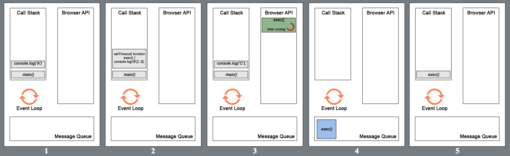
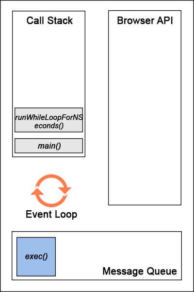

# Что такое цикл событий **(Event Loop)**?
1. [Базовая_архитектура](#Базовая_архитектура)
1. [Event_Loop](#Event_Loop)
1. [Event_Queue](#Event_Queue)
1. [JavaScript_является_однопоточным](#JavaScript_является_однопоточным)
1. [ES6_Job_Queue](#ES6_Job_Queue)
1. [Browser_events](#Browser_events)
1. [Call_Stack](#Call_Stack)
1. [Пример_кода_1](#Пример_кода_1)
1. [Пример_кода_2_Более_глубокое_понимание](#Пример_кода_2_Более_глубокое_понимание)
1. [Полезные_ссылки_и_спасибо_за_предоставленные_материалы](#Полезные_ссылки_и_спасибо_за_предоставленные_материалы)

# Базовая_архитектура

- **Heap (куча)** — объекты собраны в кучу, которая есть ни что иное, как название для наименее структурированной части памяти.  
Другими словами, **Memory Heap** — то место, где происходит выделение памяти.

- **Stack (стопка, стек) || Call Stack** — репрезентация единственного потока выполнения JavaScript-кода. Вызовы функций помещаются в стек (об этом ниже).

- **Browser or Web API’s (браузерные или веб API)** — встроены в браузер и способны предоставлять данные из браузера и окружающей компьютерной среды и давать возможность выполнять с ними полезные и сложные вещи. Они не являются частью языка JavaScript, но они построены на его основе и предоставляют вам супер силы, которые можно использовать в JavaScript коде. Например Geolocation API предоставляет доступ к нескольким простым конструкциям JavaScript, которые используются для получения данных о местоположении, так что вы можете, скажем, отобразить своё местоположение на Google Map. В фоновом режиме браузер использует низкоуровневый код (например C++) для связи с оборудованием GPS устройства (или любым другим, доступным для определения данных о местоположении), получения данных о местоположении и возвращения их в среду браузера для использования в вашем коде. Но опять, эта сложность абстрагирована от вас посредством API.

# Event_Loop
В основе любого джаваскриптового движка лежит такая конструкция, которая 
называется **eventLoop**.  

EventLoop - это простой паттерн в программировании, **это бесконечный цикл** который смотрит
на свое окружение и в зависимости от этого состояния вызывает разные инструкции.
>Другими словами - это бесконечный цикл, который после выполнения всех инструкций продолжает работать и ждет поступления
новых асинхронных команд.  

Это постоянно работающий процесс, который проверяет, пуст ли стек вызовов. 

Представьте его как часы, и каждый раз, когда он тикает, он смотрит на стек 
вызовов [Call_Stack](#Call_Stack), а если он пуст, он смотрит в очередь 
событий **(Event Queue)**. Если в очереди событий есть что-то, 
что ожидает, оно перемещается в стек вызовов. Если нет, то ничего не происходит.

# Event_Queue
Очередь событий(Event Queue) представляет собой структуру данных, аналогичную стеку(Call Stack) - снова вы добавляете элементы в конец, но можете удалять их только спереди. Он хранит правильный порядок, в котором функции должны быть выполнены. Он получает вызовы функций из таблицы событий(Event Table), но ему нужно каким-то образом отправить их в стек вызовов(Call Stack)? Вот где вступает цикл событий(Event Loop).

# JavaScript_является_однопоточным
Движок браузера выполняет JavaScript в одном потоке. Он не может поставить обработку события на паузу, переключиться на другое событие, а после — возобновить выполнение первого. Все события обрабатываются последовательно и каждое — до победного конца.

Для вышеописанного потока выделяется область памяти — **стэк**, где хранятся фреймы (аргументы, локальные переменные) вызываемых функций.

>Список событий, подлежащих обработке формируют **очередь событий(Event Queue)**. Когда стек освобождается, движок может обрабатывать событие из очереди. **Координирование этого процесса и происходит в event loop**.

В большинстве браузеров у каждой вкладки свой цикл событий(event loop), это позволяет изолировать вкладки друг от друга, и если одна зависнет, другие продолжат работать. В противном случае одна зависшая операция могла бы нарушить работу всего браузера во всех вкладках.

Вам просто нужно обратить внимание на то, как вы пишете свой код, и избегать всего, что может блокировать поток, например, **синхронных сетевых вызовов или бесконечных циклов**.

# ES6_Job_Queue
Очередь заданий (ES6 Job Queue) -> ECMAScript 2015 представил концепцию очереди заданий, которая используется в Promises.  

Это своего рода VIP-очередь, обработка которой имеет приоритет по отношению к обычной очереди.

> async/await - построен на Promises

# Browser_events
Какие же события происходят в браузере? Их великое множество:
- клики мышкой;
- скроллинг;
- ввод с клавиатуры;
- загрузка скриптов;
- CSS анимации;
- и тд.

Браузер может реагировать на эти события. Для этого событию нужно назначить обработчик, то есть функцию, которая сработает, когда событие произошло. Функция выполнится не сразу, она станет в конец очереди событий и выполнится, когда придёт её время.

# Call_Stack
Стек вызовов - это очередь LIFO (Last In, First Out).  

Другими словами -> Стек — структура данных, выполняемая в обратном порядке: LIFO — **«последним пришёл — первым вышел»**.   
Последнее, что вы добавили в стек, будет удалено первым из него.

Цикл событий(event loop) непрерывно проверяет стек вызовов(call stack), чтобы увидеть, есть ли какая-либо функция, которая должна быть запущена.  

У JavaScript есть один стек вызовов(call stack), в котором он отслеживает, какую функцию мы выполняем в настоящее время и какую функцию следует выполнить после этого. Но сначала - что такое стек? Стек - это что то вроде массива данных, но с некоторыми ограничениями: вы можете только добавлять элементы в конец и удалять только последний элемент. Другим примером является куча тарелок - вы кладете их друг на друга и в любой момент можете снять только верхнюю.

# Пример_кода_1
```js
function main() {
    console.log('A')
    setTimeout(function exec() {
    console.log('B')
    }, 0)
    console.log('C')
};
main();
// Output
// A
// C
// B
```

Здесь мы видим функцию main, включающую в себя два ``console.log``, выводящих в консоль ``A`` и ``C``. Между ними находится ``setTimeout``, вызов которого выведет в консоль B после ожидания в 0 секунд.

1. Вызов функции ``main`` сначала поместит её в стек (в качестве первого элемента (frame)). Потом браузер поместит в стек первое выражение функции ``main``, которое представляет собой ``console.log(‘A’)``. Это выражение выполняется и, после завершения, удаляется из стека. Буква A выводится в консоль.

1. Следующее выражение (``setTimeout()`` с коллбэком ``exec()`` и временем ожидания в 0 секунд) помещается в стек вызовов и выполнение начинается. Функция ``setTimeout`` использует API браузера для задержки вызова предоставленной функции. Элемент (frame) удаляется из стека сразу после завершения передачи таймера браузерному API.

1. ``console.log(‘C’)`` помещается в стек, пока в браузере запускается таймер для вызова функции ``exec()``. В этом конкретном случае, поскольку время ожидания составляет 0 секунд, коллбэк (функция ``exec()``) будет помещён в message queue (очередь сообщений), сразу после того как браузер его получит (в идеале).

1. После выполнения последнего выражения функции ``main``, элемент ``main`` удаляется из стека вызовов (call stack), оставляя его пустым. Стек вызовов должен быть пустым, для того чтобы браузер поместил в него элемент из message queue. Именно по этой причине даже если в ``setTimeout`` указано время ожидания в 0 секунд, функция ``exec()`` не выполняется, пока не закончится выполнение всех элементов в стеке вызовов.

1. Теперь функция ``exec()`` помещается в стек вызовов и выполняется. Буква C выводится в консоль. Вот он — цикл событий (EventLoop) JavaScript.

>Таким образом аргумент ``delay`` в ``setTimeout(function, delayTime)`` не означает точное время задержки, после которого функция выполнится. Он означает минимальное время ожидания, после которого в какой-нибудь момент времени, функция будет вызвана.

# Пример_кода_2_Более_глубокое_понимание
```js
function main() {
  console.log('A');

  setTimeout(function exec() {
    console.log('B');
  }, 0);

  runWhileLoopForNSeconds(3);

  console.log('C');
};

main();

function runWhileLoopForNSeconds(sec) {
  let start = Date.now();
  now = start;

  while (now - start < sec * 1000) {
    now = Date.now();
  }
};
// Output
// A
// C
// B
```

1. Функция ``runWhileLoopForNSeconds()`` делает именно то, что отражено в её названии. Она постоянно проверяет, прошло ли со времени её вызова то количество секунд, которое передано аргументом. Главное, что нужно помнить — что цикл ``while`` является блокирующим выражением, и это означает, что его выполнение происходит в стеке вызовов и не использует браузерные API. Таким образом он блокирует все последующие выражения, пока не выполнится до конца.

1. В коде выше, даже не смотря на то, что ``setTimeout`` имеет задержку в 0 секунд и цикл ``while`` выполняется 3 секунды, функция ``exec()`` застрянет в очереди сообщений. Цикл ``while`` будет выполняться в стеке вызовов (в котором один поток), пока не пройдет 3 секунды. И только после того, как стек вызовов опустеет, функция ``exec()`` будет помещена в стек и выполнена.

>Таким образом аргумент ``delay`` в ``setTimeout()`` не гарантирует начала выполнения после завершения указанной задержки. Он **является минимальным временем задержки**.

# Полезные_ссылки_и_спасибо_за_предоставленные_материалы:
- [JavaScript event loop в картинках](https://medium.com/@pavelbely/javascript-event-loop-%D0%B2-%D0%BA%D0%B0%D1%80%D1%82%D0%B8%D0%BD%D0%BA%D0%B0%D1%85-%D1%87%D0%B0%D1%81%D1%82%D1%8C-1-a19e4d99f242)
- [Understanding JS: The Event Loop](https://hackernoon.com/understanding-js-the-event-loop-959beae3ac40)
- [The JavaScript Event Loop](https://flaviocopes.com/javascript-event-loop/)
- [The JavaScript Event Loop - rus](https://tproger.ru/blogs/effective-code-in-js-with-event-loop/)
- [Игорь Алексеенко — Почему мой сайт тормозит и как это исправить HolyJs](https://www.youtube.com/watch?v=z9YG9XBwCKo)
- [Объяснение работы EventLoop в JavaScript](https://medium.com/devschacht/javascript-eventloop-explained-f2dcf84e36ee)
- [Контекст выполнения](lectures/js/execution_context/execution_context.md)
