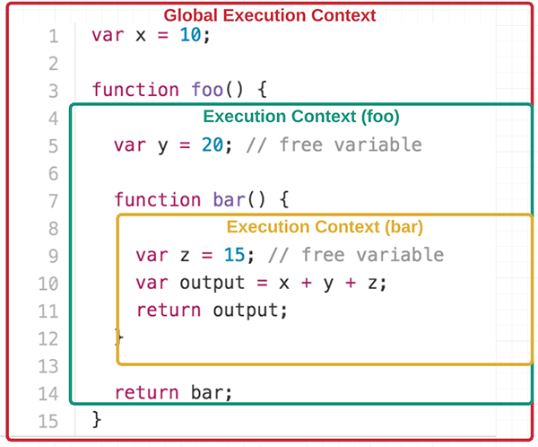

# Контекст выполнения
1. [Определение](#Определение)
1. [Полезные_ссылки_и_спасибо_за_предоставленные_материалы](#Полезные_ссылки_и_спасибо_за_предоставленные_материалы)

# Определение
Контекст выполнения — это абстрактное понятие, которое используется в спецификации ECMAScript для оценки времени выполнения кода.  

В любой момент времени выполняется только один контекст функции (тело функции). Вот почему JavaScript является однопотоковым, так как единовременно может выполняться только одна команда.  

Обычно браузеры поддерживают этот контекст с помощью **стека — stack**.   
**Стек** — структура данных, выполняемая в обратном порядке: **LIFO (Last In, First Out)** — «последним пришёл — первым вышел». Последнее, что вы добавили в стек, будет удалено первым из него.  

Текущий или «выполняющийся» контекст исполнения — всегда верхний элемент стека. Он выскакивает из стека, когда код в текущем контексте полностью разобран, позволяя следующему верхнему элементу стека взять на себя контекст выполнения.

> Если контекст уже выполняется, это не означает, что ему нужно завершить своё выполнение, прежде чем другой контекст выполнения сможет начать работу. Бывают случаи, когда контекст приостанавливается и другой контекст начинает работу. Прерванный контекст может быть позже забран обратно наверх в том месте, где он был приостановлен. В любое время один контекст может быть заменён другим, и этот новый контекст поместится в стек, став текущим контекстом выполнения.

# Полезные_ссылки_и_спасибо_за_предоставленные_материалы:
- [Что такое замыкания? - htmlacademy](https://htmlacademy.ru/blog/boost/frontend/lets-learn-javascript-closures)