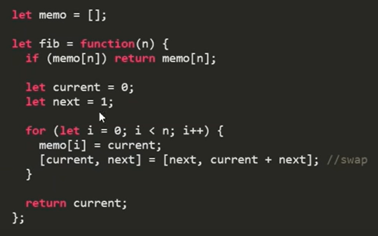

# Фибоначчи
1. [Пример рекурсии](#Пример_рекурсии)
1. [Пример_Правильная_рекурсия_работающая_за_линейное_время](#Пример_Правильная_рекурсия_работающая_за_линейное_время)
1. [Пример_мемоизации](#Пример_мемоизации)
1. [Пример_БЕЗ_рекурсии](#Пример_БЕЗ_рекурсии)
1. [Пример_по_формуле_Бине](#Пример_по_формуле_Бине)
1. [Полезные_ссылки_и_спасибо_за_предоставленные_материалы](#Полезные_ссылки_и_спасибо_за_предоставленные_материалы)


**Фибоначчи** - Это класический пример рекурсии.

**Ряд чисел Фибоначчи** - первые два числа равны либо 1 и 1, либо 0 и 1, а каждое последующее число равно сумме двух предыдущих чисел.

## Пример_рекурсии:
```js
function recursive(n) {
    if(n <= 2) {
        return 1;
    }

    return recursive(n - 1) + recursive(n - 2);
}
```
Запомните этот вариант. Так делать не стоит.   
Возможно, вы спросите, почему.
В таком случае просто запустите этот код и попытайтесь посчитать, скажем, пятидесятое число Фибоначчи. 
Полагаю, если вы запускаете этот код не на суперкомпьютере, то попросту не дождётесь результата. При том, что простой, не рекурсивный код из предыдущих примеров посчитает пятидесятый член последовательности Фибоначчи быстрее, чем вы успеете произнести слово «пятьдесят».
Выражаясь грубым языком [O-нотации](../algorithms/bigOBase/bigO.md), **такое решение имеет временную сложность O(e в степени n).** То есть — время выполнения этой функции растёт экспоненциально при увеличении n. То есть — когда n увеличивается на, время выполнения увеличивается в. Грубо говоря, если fib(45) вам пришлось ждать час, то **fib(46) вы будете ждать два часа, fib(47) — 4 часа, и так далее**.

## Пример_Правильная_рекурсия_работающая_за_линейное_время:
```js
const fib2 = n => {
  if(n == 0){
    return [0, 1];
  } else {
    const [prev, next] = fib2(n - 1);
    return [next, prev + next];
  }
}

const fib = n => fib2(n)[0];
```
Несмотря на то, что числа Фибоначчи являются классическим, примером рекурсии, в действительности это не самый удобный случай для применения рекурсии.

## Пример_мемоизации:
Мемомоизация - сохранение результатов выполнения функций для
предотвращения повторных вычислений. 
Мы просто запоминаем результаты предыдущих вызовов вместо того, чтобы вычислять их заново.  
>**Предотвращение повторных вычислений** - это один из способов оптимизации.




## Пример_БЕЗ_рекурсии: 
```js
const fib = n => {
  let prev = 0, next = 1;
  for(let i = 0; i < n; i++){
    next = prev + next;
    prev = next - prev;
  }
  return prev;
}
```
Это — вариант классический, простой

## Пример_по_формуле_Бине: 
```js
const fib = n => {
  const a = (1 + 5 ** 0.5) / 2;
  return Math.round(a ** n / 5 ** 0.5);
}
```
Всё будет хорошо до числа за номером 76. Которое должно быть равно 3416454622906707, а наша функция вычислит 3416454622906706. Потому что проблема ограниченной точности дробных чисел никуда не делась, мы просто затолкали её поглубже и надеялись, что она не всплывёт. Как показывает данный пример — надеялись напрасно. Но проблема решаема.

## Полезные_ссылки_и_спасибо_за_предоставленные_материалы:
- [Фибоначчи на собеседовании](https://habr.com/ru/post/449616/)
- [Algorithms and data structures. Part1](https://www.youtube.com/watch?v=cWwoU6fjYDQ&index=3&list=PLe--kalBDwjhdXudsOpKooP6q9bAl3rPG)
- [Understanding Memoization In JavaScript](https://scotch.io/tutorials/understanding-memoization-in-javascript)
