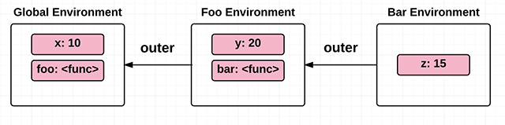

# Цепочки областей видимости
1. [Определение](#Определение)
1. [Пример](#Пример)
1. [Полезные_ссылки_и_спасибо_за_предоставленные_материалы](#Полезные_ссылки_и_спасибо_за_предоставленные_материалы)


# Определение
Окружение имеет доступ к окружению своего родителя, его родительское окружение имеет доступ к своему родительскому окружению и так далее. Этот набор идентификаторов, к которому каждое окружение имеет доступ, называется область видимости — **scope**.

# Пример
```js
var x = 10;

function foo() {
  var y = 20; // свободная переменная
  function bar() {
    var z = 15; // свободная переменная
    return x + y + z;
  }
  return bar;
}
```


# Полезные_ссылки_и_спасибо_за_предоставленные_материалы
- [htmlacademy](https://htmlacademy.ru/blog/boost/frontend/lets-learn-javascript-closures)